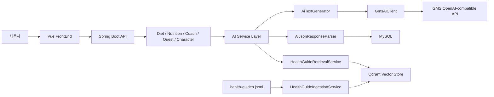
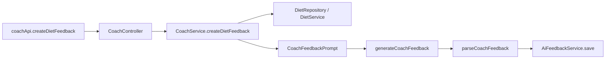
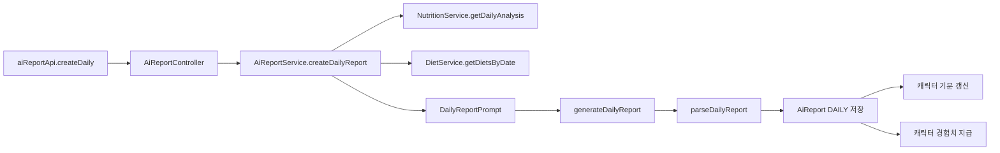
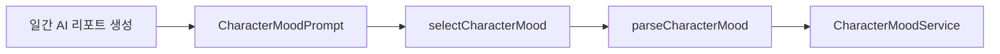
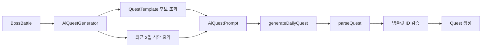
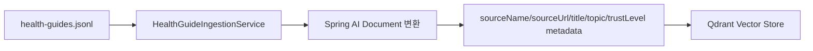
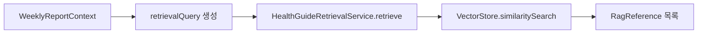

```mermaid
flowchart LR
    FE["aiReportApi.createWeekly"] --> Controller["AiReportController"]
    Controller --> Service["AiReportService.createWeeklyReport"]
    Service --> Context["WeeklyReportContextService.collect"]
    Context --> Retrieval["HealthGuideRetrievalService.retrieve"]
    Retrieval --> Refs["RagReference"]
    Context --> Prompt["WeeklyReportPrompt"]
    Refs --> Prompt
    Prompt --> AI["generateWeeklyReport"]
    AI --> Parser["parseWeeklyReport"]
    Parser --> Save["AiReport WEEKLY 저장"]
```

# PlayEat AI 기능 구현 보고서

## 1. 보고서 목적

PlayEat의 AI 기능은 단순히 식단 데이터를 요약하는 데 그치지 않고, 사용자의 식단 기록을 행동 변화로 이어지게 만드는 코칭 장치다. 현재 구현은 크게 두 영역으로 나뉜다.

1. **단순 AI API 호출 기능**
   - 저장된 식단, 영양 분석, 코치 성격, 퀘스트 후보 데이터를 프롬프트로 구성한다.
   - GMS의 OpenAI 호환 Chat Completions API를 호출한다.
   - 응답 JSON을 파싱해 코치 피드백, 일간 리포트, 캐릭터 기분, 개인 퀘스트에 반영한다.

2. **RAG 기반 AI 기능**
   - 공식 건강 가이드 문서를 Qdrant 벡터 DB에 적재한다.
   - 주간 식단 패턴으로 검색 질의를 만들고 관련 건강 가이드를 검색한다.
   - 검색 결과를 주간 리포트 프롬프트에 함께 넣어 더 근거 있는 조언을 생성한다.

## 2. 전체 AI 아키텍처



AI 호출 공통 흐름은 다음과 같다.

1. 컨트롤러 또는 도메인 서비스가 AI 기능을 요청한다.
2. 서비스가 사용자 식단, 영양 분석, 건강 프로필, 코치 설정 등을 조회한다.
3. 기능별 Prompt record를 만들어 `AiTextGenerator`에 전달한다.
4. `gms.enabled=true`면 `GmsAiTextGenerator`가 GMS API를 호출한다.
5. `gms.enabled=false`면 `PlaceholderAiTextGenerator`가 더미 JSON을 반환한다.
6. `AiJsonResponseParser`가 응답에서 JSON 객체만 추출해 DTO로 파싱한다.
7. 결과를 `AiReport`, `AiFeedback`, `Quest`, `Character` 관련 데이터에 반영한다.

## 3. 단순 AI API 호출 기능

단순 API 호출 기능은 별도의 문서 검색 없이, 서비스 DB에 이미 있는 사용자 데이터만으로 프롬프트를 구성한다.

### 3.1 한 끼 코치 피드백

**기능 목적**

사용자가 특정 식단을 기록한 뒤, 선택한 AI 코치의 말투로 짧은 피드백을 제공한다. 사용자는 숫자 중심의 영양 정보보다 "다음 끼니에서 무엇을 조정하면 되는지"를 빠르게 이해할 수 있다.

**사용 데이터**

- 식단 ID
- 식사 구분
- 음식명, 입력량, 단위
- 총 칼로리, 탄수화물, 단백질, 지방, 나트륨
- 선택된 코치의 이름, 역할, 말투 설명
- 주의 문구
  - 800kcal 이상
  - 나트륨 1500mg 이상
  - 총 섭취량 800g/ml 이상

**프롬프트 예시**

```text
너는 PlayEat의 식단 코치다.
아래 식단 기록을 보고 사용자가 부담 없이 바로 실천할 수 있는 한 끼 피드백을 작성해라.

[코치 정보]
- 이름: {coachName}
- 역할: {coachRole}
- 말투: {coachToneDescription}

[식사 정보]
- 식사 구분: {mealType}
- 음식 목록: {mealItems}
- 총 칼로리: {totalCalories}kcal
- 탄수화물: {carbs}g
- 단백질: {protein}g
- 지방: {fat}g
- 나트륨: {sodium}mg
- 주의 사항: {cautionText}

[작성 조건]
- 코치의 말투를 반영한다.
- 1~2문장으로 짧게 작성한다.
- 사용자를 비난하지 않는다.
- 다음 끼니에서 바로 실천할 행동을 1개 포함한다.
- 의학적 진단이나 치료 표현은 사용하지 않는다.
- 반드시 JSON만 반환한다.

[출력 형식]
{
  "message": "피드백 문장"
}
```

**처리 흐름**



**출력 및 저장**

- AI 응답 형식: `{ "message": "..." }`
- 저장 위치: `AiFeedback`
- 응답 DTO: `CoachFeedbackResponse`
- 모델명도 함께 저장해 어떤 모델이 피드백을 생성했는지 추적할 수 있다.

**API**

- `GET /api/v1/coaches`
- `PUT /api/v1/coaches/me`
- `GET /api/v1/coaches/me/diets/{dietId}/feedback`
- `POST /api/v1/coaches/me/diets/{dietId}/feedback`
- `POST /api/v1/coaches/me/diets/{dietId}/feedbacks`

### 3.2 일간 AI 리포트

**기능 목적**

하루 식단과 영양 분석 결과를 바탕으로 일간 요약, 잘한 점, 주의할 점, 다음 행동을 생성한다. 건강 점수 자체는 AI가 계산하지 않고 기존 영양 분석 로직에서 계산하며, AI는 그 결과를 사용자가 이해하기 쉬운 문장으로 바꾼다.

**사용 데이터**

- 날짜
- 일간 건강 점수
- 영양소별 분석 결과
- 하루 식단 요약
- 식사별 기록 여부 및 음식 목록

**프롬프트 예시**

```text
너는 PlayEat의 AI 식단 리포트 작성자다.
사용자의 하루 식단 기록과 영양 분석 결과를 바탕으로 일간 리포트를 작성해라.

[기준 날짜]
{date}

[건강 점수]
{healthScore}

[영양 분석]
{nutrientAnalysis}

[하루 식단 요약]
{mealSummaries}

[작성 조건]
- 건강 점수는 새로 계산하지 말고 제공된 값을 그대로 해석한다.
- summary는 오늘 식단의 전체 흐름을 1~2문장으로 요약한다.
- strengths는 잘한 점을 1~3개 작성한다.
- warnings는 주의할 점을 1~3개 작성한다.
- nextAction은 다음 식사에서 할 수 있는 행동 1개로 작성한다.
- 과장된 표현, 공포감을 주는 표현, 의학적 진단 표현은 사용하지 않는다.
- 반드시 JSON만 반환한다.

[출력 형식]
{
  "summary": "오늘 식단 요약",
  "strengths": ["잘한 점 1", "잘한 점 2"],
  "warnings": ["주의할 점 1"],
  "nextAction": "다음 식사에서 실천할 행동"
}
```

**처리 흐름**



**출력 및 저장**

- AI 응답 필드
  - `summary`
  - `strengths`
  - `warnings`
  - `nextAction`
- 저장 위치: `AiReport`
- 리포트 타입: `DAILY`
- 부가 효과
  - 일간 리포트 기반 캐릭터 기분 업데이트
  - 건강 점수 기반 경험치 지급

**API**

- `GET /api/v1/ai/reports/daily?date=YYYY-MM-DD`
- `POST /api/v1/ai/reports/daily`

### 3.3 캐릭터 기분 선택

**기능 목적**

일간 AI 리포트 결과와 건강 점수를 바탕으로 냠냠 캐릭터의 기분을 정한다. 식단 관리 결과가 캐릭터 변화로 이어지기 때문에, 사용자는 단순 기록보다 더 강한 피드백을 받는다.

**사용 데이터**

- 일간 건강 점수
- 일간 리포트 요약
- 잘한 점
- 주의할 점
- 다음 행동

**프롬프트 예시**

```text
너는 PlayEat의 캐릭터 상태를 선택하는 AI다.
일간 리포트 결과를 보고 오늘 캐릭터에게 가장 어울리는 기분을 하나만 선택해라.

[건강 점수]
{healthScore}

[일간 리포트]
- 요약: {summary}
- 잘한 점: {strengths}
- 주의할 점: {warnings}
- 다음 행동: {nextAction}

[선택 가능한 mood]
- NORMAL: 전반적으로 무난하거나 균형 잡힌 상태
- HUNGRY: 섭취량이 부족하거나 에너지가 모자란 상태
- CHUBBY: 과식, 고칼로리, 고나트륨 등 조절이 필요한 상태
- MUSCLE: 단백질, 균형, 목표 달성이 좋은 상태

[작성 조건]
- mood는 위 목록 중 하나만 사용한다.
- reason은 사용자가 이해할 수 있게 1문장으로 작성한다.
- 반드시 JSON만 반환한다.

[출력 형식]
{
  "mood": "NORMAL",
  "reason": "선택 이유"
}
```

**처리 흐름**



**출력**

- AI 응답 필드
  - `mood`
  - `reason`
- 허용 기분 예시
  - `NORMAL`
  - `HUNGRY`
  - `CHUBBY`
  - `MUSCLE`
- `mood`가 비어 있으면 파서에서 `NORMAL`로 보정한다.

### 3.4 AI 개인 퀘스트 생성

**기능 목적**

보스전 또는 길드 흐름에서 사용자별 식단 패턴에 맞는 개인 퀘스트를 생성한다. 완전히 자유로운 퀘스트를 새로 만드는 것이 아니라, 기존 퀘스트 템플릿 후보 중 하나를 AI가 선택하고 제목/설명을 일부 커스터마이징하는 방식이다.

**사용 데이터**

- 보스전 정보
- 사용자 정보
- 활성 멤버 수와 멤버 순번
- 최근 3일 식단 요약
- 난이도에 맞는 퀘스트 템플릿 후보
- 최근 3일 내 이미 사용한 템플릿 제외 결과

**프롬프트 예시**

```text
너는 PlayEat의 보스전 개인 퀘스트 추천 AI다.
사용자의 최근 식단 패턴과 사용 가능한 퀘스트 템플릿을 보고 가장 적합한 템플릿 하나를 선택해라.

[보스전 정보]
- 보스전 ID: {battleId}
- 난이도: {difficulty}
- 활성 멤버 수: {activeMemberCount}
- 사용자 순번: {memberIndex}

[최근 3일 식단 요약]
{recentDietSummary}

[사용 가능한 퀘스트 템플릿]
{availableQuestTemplates}

[작성 조건]
- selectedTemplateId는 반드시 사용 가능한 템플릿 목록 안에서만 선택한다.
- 최근 식단 문제와 가장 관련 있는 템플릿을 고른다.
- customTitle은 20자 이내로 작성한다.
- customDescription은 200자 이내로 작성한다.
- 사용자를 비난하지 않고 게임 퀘스트처럼 동기부여되는 문장으로 작성한다.
- 반드시 JSON만 반환한다.

[출력 형식]
{
  "selectedTemplateId": 1,
  "customTitle": "오늘의 퀘스트 제목",
  "customDescription": "퀘스트 설명"
}
```

**처리 흐름**



**출력 및 저장**

- AI 응답 필드
  - `selectedTemplateId`
  - `customTitle`
  - `customDescription`
- 저장 위치: `Quest`
- `sourceType`: `AI`
- AI가 잘못된 템플릿 ID를 반환하면 후보 밖 선택을 버리고 fallback 로직을 사용한다.

**Fallback 기준**

- 기록이 부족하면 식단 기록 퀘스트 우선
- 나트륨이 높으면 나트륨 관련 퀘스트
- 당류가 높으면 당류 관련 퀘스트
- 단백질이 목표의 70% 미만이면 단백질 관련 퀘스트
- 식이섬유가 기준의 70% 미만이면 식이섬유 관련 퀘스트
- 그 외에는 사용자/보스전 정보를 기반으로 결정적 선택

## 4. RAG 기반 AI 기능

RAG는 "사용자 데이터 + 공식 건강 가이드 검색 결과"를 함께 AI에 제공하는 구조다. 현재는 주간 리포트에서 사용된다.

### 4.1 건강 가이드 문서 적재

**기능 목적**

나트륨, 당류, 비만, 만성질환, 균형 식사 등 건강 관련 공식 가이드 문서를 벡터 DB에 적재해 이후 검색에 사용한다.

**데이터 소스**

- `BackEnd/src/main/resources/rag/health-guides/health-guides.jsonl`
- 각 라인은 다음 정보를 가진다.
  - `id`
  - `sourceName`
  - `sourceUrl`
  - `documentTitle`
  - `topic`
  - `trustLevel`
  - `content`

**처리 흐름**



**설정**

- `rag.health-guides.seed-location`
- `rag.health-guides.ingestion-enabled`
- `spring.ai.vectorstore.qdrant.collection-name`
- `spring.ai.openai.embedding.options.model`

로컬 예시 설정에서는 `rag.health-guides.ingestion-enabled=true`, Qdrant 컬렉션은 `nyamnyam_health_guides`로 되어 있다.

### 4.2 건강 가이드 검색

**기능 목적**

주간 식단에서 반복되는 영양 문제를 검색 질의로 만들고, 관련 공식 가이드 문서를 찾아 주간 리포트 생성에 전달한다.

**처리 흐름**



**검색 설정**

- `topK`: 기본 5
- `similarityThreshold`: 기본 0.5
- 검색 결과 필드
  - 본문 text
  - 유사도 score
  - 출처명
  - 출처 URL
  - 문서 제목
  - 주제

VectorStore가 없거나 검색어가 비어 있거나 검색 중 오류가 발생하면 빈 목록을 반환한다. 즉, RAG가 실패해도 주간 리포트 생성 자체는 진행 가능한 구조다.

### 4.3 주간 AI 리포트

**기능 목적**

일주일 동안의 식단, 영양 분석, 반복 패턴, 건강 프로필을 종합하고 RAG 검색 결과를 참고해 주간 단위의 조언을 생성한다.

**사용 데이터**

- 주간 시작일, 종료일
- 일별 식단 요약
- 일별 영양 분석 요약
- 주간 평균 건강 점수
- 건강 프로필 요약
- 반복되는 영양 주의 패턴
- RAG 검색으로 찾은 공식 건강 가이드

**프롬프트 예시**

```text
너는 PlayEat의 주간 식단 리포트 작성자다.
사용자의 일주일 식단 기록, 영양 분석, 반복 패턴, 건강 프로필, 공식 건강 가이드 참고자료를 바탕으로 주간 리포트를 작성해라.

[분석 기간]
{startDate} ~ {endDate}

[주간 평균 건강 점수]
{averageHealthScore}

[건강 프로필 요약]
{healthProfileSummary}

[일별 식단 요약]
{dailyMealSummaries}

[일별 영양 분석 요약]
{dailyNutritionSummaries}

[반복되는 식단/영양 패턴]
{repeatedPatterns}

[RAG 참고자료]
{ragReferences}

[작성 조건]
- RAG 참고자료는 공식 건강 가이드를 보조 근거로만 사용한다.
- 참고자료에 없는 내용을 확정적인 사실처럼 말하지 않는다.
- 질병 진단, 치료 지시, 약물 조언은 하지 않는다.
- summary는 이번 주 식단 흐름을 1~2문장으로 요약한다.
- strengths는 유지하면 좋은 점을 1~3개 작성한다.
- warnings는 반복적으로 조정이 필요한 점을 1~3개 작성한다.
- nextAction은 다음 주에 가장 먼저 실천할 행동 1개로 작성한다.
- 반드시 JSON만 반환한다.

[출력 형식]
{
  "summary": "이번 주 식단 요약",
  "strengths": ["잘한 점 1", "잘한 점 2"],
  "warnings": ["주의할 점 1"],
  "nextAction": "다음 주 실천 행동"
}
```

**처리 흐름**



**출력 및 저장**

- AI 응답 필드
  - `summary`
  - `strengths`
  - `warnings`
  - `nextAction`
- 저장 위치: `AiReport`
- 리포트 타입: `WEEKLY`
- 기간 검증
  - 시작일은 월요일이어야 한다.
  - 종료일은 시작일로부터 6일 뒤여야 한다.

**API**

- `GET /api/v1/ai/reports/weekly?startDate=YYYY-MM-DD&endDate=YYYY-MM-DD`
- `POST /api/v1/ai/reports/weekly`

## 5. GMS API 호출 구조

현재 실제 AI 호출은 `GmsAiClient`가 담당한다.

**설정값**

- `gms.enabled`
- `gms.base-url`
- `gms.model`
- `gms.embedding-model`
- `gms.api-key`
- `gms.timeout-ms`

**기본 호출 방식**

- Endpoint: `/chat/completions`
- 인증: `Authorization: Bearer {GMS_KEY}`
- 요청 데이터
  - `model`
  - `messages`
- 응답 추출 우선순위
  - `choices[0].message.content`
  - `output_text`
  - `output[].content[].text`

`gms.enabled=false`일 때는 `PlaceholderAiTextGenerator`가 선택되므로, API 키 없이도 프론트와 백엔드 흐름을 개발하거나 시연할 수 있다.

## 6. 프롬프트 설계 원칙

현재 구현 기준으로 프롬프트는 기능별 record로 분리되어 있다.

- `CoachFeedbackPrompt`
- `DailyReportPrompt`
- `WeeklyReportPrompt`
- `CharacterMoodPrompt`
- `AiQuestPrompt`
- `QuestTemplatePrompt`

프롬프트 설계 방향은 다음과 같다.

1. 실제 기록 데이터만 사용한다.
2. 의학적 진단처럼 표현하지 않는다.
3. 한 번에 하나 이상의 실천 행동을 과하게 요구하지 않는다.
4. 사용자의 식단 기록 지속을 해치지 않도록 비난형 문장을 피한다.
5. 응답은 JSON 형태로 제한해 서버에서 안정적으로 파싱한다.
6. 주간 리포트는 RAG 검색 결과를 참고하되, 개인 질환 진단이나 치료 지시로 확장하지 않는다.

## 7. AI 응답 파싱 및 안정성

`AiJsonResponseParser`는 AI 응답에서 첫 `{`부터 마지막 `}`까지를 추출한 뒤 Jackson으로 DTO에 매핑한다.

**파싱 대상**

- `DailyReportContent`
- `WeeklyReportContent`
- `CoachFeedbackContent`
- `AiQuestContent`
- `CharacterMoodContent`

**예외 처리**

- JSON이 없거나 파싱에 실패하면 `AI_RESPONSE_PARSE_FAILED`
- API 키가 없거나 제공자 호출이 실패하면 `AI_PROVIDER_UNAVAILABLE`
- 캐릭터 기분 응답에서 `mood`가 비어 있으면 `NORMAL`로 보정
- RAG 검색 실패는 빈 참고자료로 처리해 주간 리포트 생성 흐름을 막지 않음
- AI 퀘스트가 후보에 없는 템플릿을 선택하면 fallback 템플릿 사용

## 8. 단순 API 호출과 RAG 비교

| 항목        | 단순 AI API 호출                                 | RAG 기반 AI                             |
| ----------- | ------------------------------------------------ | --------------------------------------- |
| 사용 기능   | 코치 피드백, 일간 리포트, 캐릭터 기분, AI 퀘스트 | 주간 AI 리포트                          |
| 입력 데이터 | DB에 저장된 사용자 식단/영양/코치/퀘스트 데이터  | 사용자 주간 데이터 + 검색된 건강 가이드 |
| 외부 저장소 | 없음                                             | Qdrant Vector DB                        |
| 장점        | 구조가 단순하고 응답이 빠름                      | 공식 가이드 기반으로 조언 근거 강화     |
| 실패 대응   | Placeholder 또는 BusinessException               | 검색 실패 시 빈 참고자료로 계속 진행    |
| 적합한 화면 | 식단 상세, 일간 분석, 캐릭터, 보스/퀘스트        | 주간 분석, 장기 패턴 분석               |
