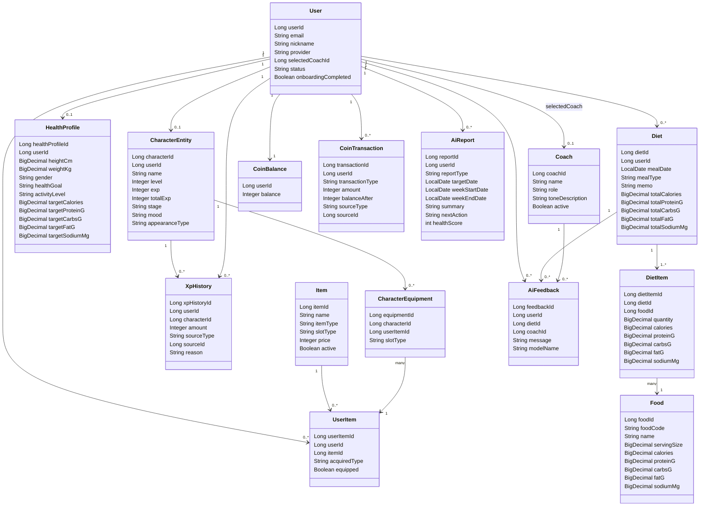
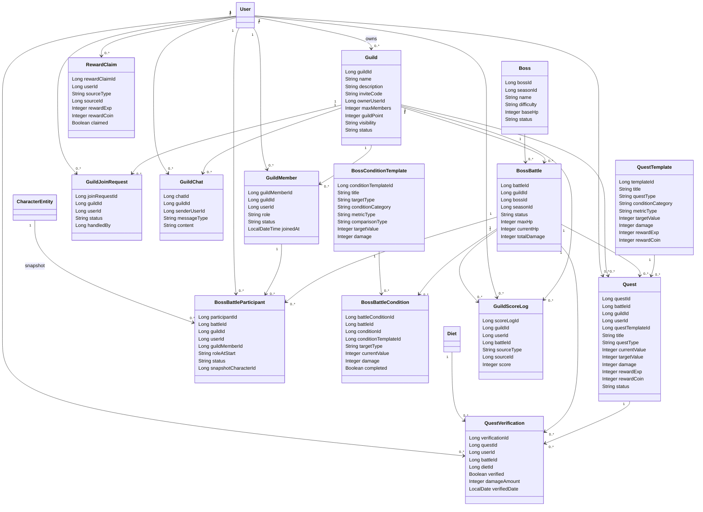

# NyamNyam Coach Class Diagram

이 문서는 현재 백엔드 구현(`com.nyamnyam.coach`)과 `BackEnd/scripts/init.sql`의 관계를 기준으로 작성한 클래스 다이어그램입니다. DTO는 수가 많아 제외하고, 도메인 엔티티와 핵심 애플리케이션 계층 의존성을 중심으로 정리했습니다.

## Application Layer

```mermaid
classDiagram
direction LR

class AuthController
class UserController
class FoodController
class DietController
class NutritionController
class AnalysisController
class CharacterController
class CoachController
class AiReportController
class GuildController
class GuildChatController
class BossController
class BossBattleController
class QuestController
class ShopController
class ItemController
class CharacterEquipmentController
class CoinController
class RankingController
class DashboardController

class AuthService
class UserService
class FoodService
class DietService
class NutritionService
class AnalysisService
class CharacterService
class CharacterGrowthService
class CharacterMoodService
class CoachService
class AiReportService
class AiFeedbackService
class GuildService
class GuildChatService
class GuildValidator
class BossService
class BossBattleService
class QuestService
class QuestVerificationService
class QuestRewardService
class ConditionEvaluationService
class ShopService
class ItemService
class EquipmentService
class CoinService
class RankingService
class GuildScoreService
class DashboardService

class UserRepository
class HealthProfileRepository
class FoodRepository
class DietRepository
class NutritionRepository
class CharacterRepository
class XpHistoryRepository
class CoachRepository
class AiReportRepository
class AiFeedbackRepository
class GuildRepository
class GuildChatRepository
class BossRepository
class BossBattleRepository
class BossBattleParticipantRepository
class QuestRepository
class QuestTemplateRepository
class ItemRepository
class CharacterEquipmentRepository
class CoinRepository
class RankingRepository
class GuildScoreRepository
class DashboardRepository

AuthController --> AuthService
UserController --> UserService
FoodController --> FoodService
DietController --> DietService
NutritionController --> NutritionService
AnalysisController --> AnalysisService
CharacterController --> CharacterService
CoachController --> CoachService
AiReportController --> AiReportService
GuildController --> GuildService
GuildChatController --> GuildChatService
BossController --> BossService
BossBattleController --> BossBattleService
BossBattleController --> QuestVerificationService
BossBattleController --> QuestRewardService
QuestController --> QuestService
QuestController --> QuestVerificationService
QuestController --> QuestRewardService
ShopController --> ShopService
ItemController --> ItemService
CharacterEquipmentController --> EquipmentService
CoinController --> CoinService
RankingController --> RankingService
DashboardController --> DashboardService

AuthService --> UserRepository
AuthService --> CharacterGrowthService
UserService --> UserRepository
UserService --> HealthProfileRepository
UserService --> CharacterGrowthService
FoodService --> FoodRepository
DietService --> DietRepository
DietService --> FoodRepository
DietService --> CharacterGrowthService : event listener
DietService --> QuestVerificationService : event listener
NutritionService --> NutritionRepository
AnalysisService --> DietService
AnalysisService --> NutritionService
AnalysisService --> CoachService
AnalysisService --> AiReportService
CharacterService --> CharacterRepository
CharacterService --> XpHistoryRepository
CharacterGrowthService --> CharacterRepository
CharacterGrowthService --> XpHistoryRepository
CharacterMoodService --> CharacterRepository
CoachService --> CoachRepository
CoachService --> DietRepository
CoachService --> AiFeedbackService
AiReportService --> AiReportRepository
AiReportService --> DietService
AiReportService --> NutritionService
AiReportService --> CharacterGrowthService
AiReportService --> CharacterMoodService
AiFeedbackService --> AiFeedbackRepository
GuildService --> GuildRepository
GuildService --> UserRepository
GuildService --> GuildValidator
GuildService --> GuildScoreService
GuildService --> GuildChatService
GuildChatService --> GuildChatRepository
GuildChatService --> GuildValidator
GuildValidator --> GuildRepository
BossService --> BossRepository
BossBattleService --> BossBattleRepository
BossBattleService --> BossBattleParticipantRepository
BossBattleService --> GuildValidator
QuestService --> QuestRepository
QuestService --> QuestTemplateRepository
QuestVerificationService --> QuestRepository
QuestVerificationService --> BossBattleParticipantRepository
QuestVerificationService --> ConditionEvaluationService
QuestVerificationService --> GuildScoreService
QuestVerificationService --> GuildChatService
QuestRewardService --> QuestRepository
QuestRewardService --> CharacterGrowthService
QuestRewardService --> CoinService
ConditionEvaluationService --> QuestRepository
ShopService --> ItemRepository
ShopService --> ItemService
ShopService --> EquipmentService
ShopService --> CoinService
ItemService --> ItemRepository
EquipmentService --> CharacterRepository
EquipmentService --> CharacterEquipmentRepository
EquipmentService --> ItemService
CoinService --> CoinRepository
RankingService --> RankingRepository
RankingService --> GuildScoreService
GuildScoreService --> GuildScoreRepository
DashboardService --> DashboardRepository
DashboardService --> GuildScoreRepository
DashboardService --> RankingService
DashboardService --> GuildValidator
```

## Core Domain Entities

## Guild, Boss, Quest, Ranking

## Main Enums

```mermaid
classDiagram
class MealType {
  <<enumeration>>
  BREAKFAST
  LUNCH
  DINNER
  SNACK
}

class CharacterStage {
  <<enumeration>>
}

class CharacterMood {
  <<enumeration>>
}

class CharacterAppearanceType {
  <<enumeration>>
}

class XpSourceType {
  <<enumeration>>
}

class CoinTransactionType {
  <<enumeration>>
}

class CoinSourceType {
  <<enumeration>>
}

class ItemType {
  <<enumeration>>
}

class ItemSlotType {
  <<enumeration>>
}

class UserItemAcquiredType {
  <<enumeration>>
}

class GuildRole {
  <<enumeration>>
}

class GuildStatus {
  <<enumeration>>
}

class GuildVisibility {
  <<enumeration>>
}

class JoinRequestStatus {
  <<enumeration>>
}

class GuildChatMessageType {
  <<enumeration>>
}

class BossStatus {
  <<enumeration>>
}

class BossDifficulty {
  <<enumeration>>
}

class BossBattleStatus {
  <<enumeration>>
}

class BossBattleParticipantStatus {
  <<enumeration>>
}

class BossConditionTargetType {
  <<enumeration>>
}

class DamageSourceType {
  <<enumeration>>
}

class RewardClaimSourceType {
  <<enumeration>>
}

class QuestType {
  <<enumeration>>
}

class QuestStatus {
  <<enumeration>>
}

class QuestSourceType {
  <<enumeration>>
}

class QuestConditionCategory {
  <<enumeration>>
}

class QuestMetricType {
  <<enumeration>>
}

class QuestComparisonType {
  <<enumeration>>
}

class QuestAggregationType {
  <<enumeration>>
}

class QuestEvaluationScope {
  <<enumeration>>
}

class GuildScoreSourceType {
  <<enumeration>>
}
```

## Notes

- Java 엔티티는 대부분 FK 객체 참조 대신 `Long ...Id` 필드로 관계를 표현합니다. 위 다이어그램의 연관선은 `init.sql`의 외래키와 서비스 로직 기준의 개념 관계입니다.
- `daily_nutrition_summaries`, `boss_seasons`, `boss_common_conditions`, `boss_battle_damage_logs`, `guild_notices` 등 일부 테이블은 현재 전용 엔티티보다 row/response 객체 또는 SQL 중심으로 다뤄지므로 핵심 클래스 다이어그램에서는 축약했습니다.
- 컨트롤러 성공 응답은 공통적으로 `ResponseEntity<ApiResponse<...>>` 구조를 사용하고, 예외는 `BusinessException`과 도메인별 `ErrorCode` enum으로 정리됩니다.
