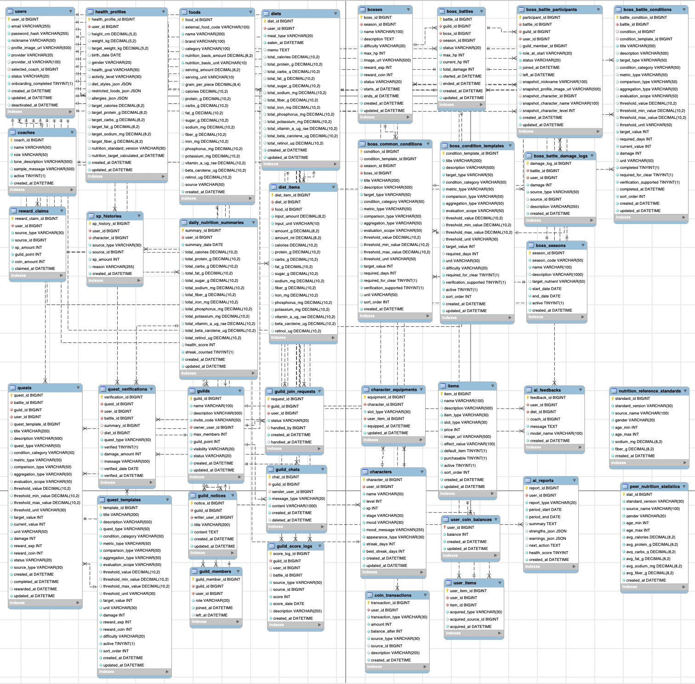
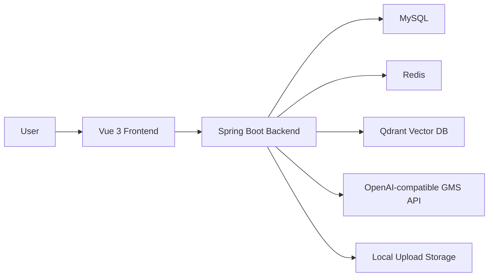
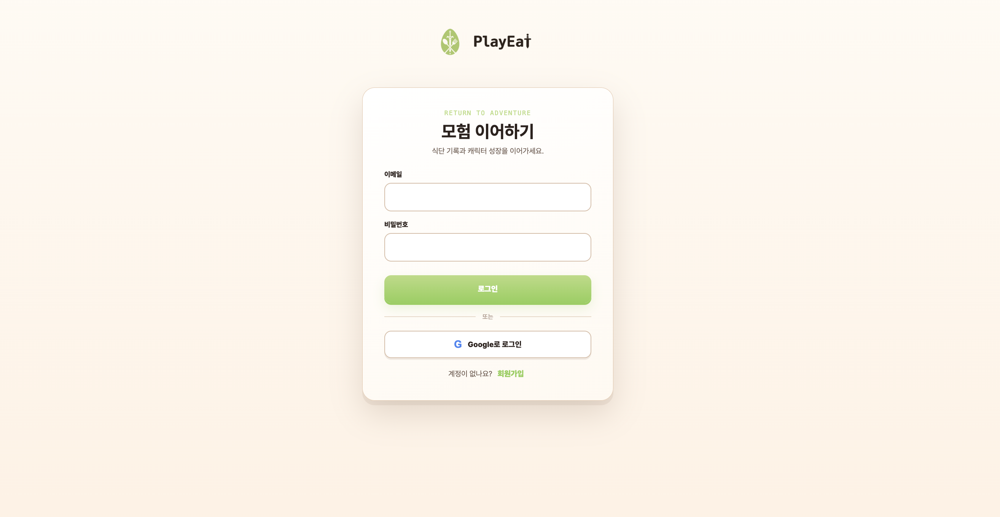

# PlayEat

> 식단 기록을 AI 분석, 캐릭터 성장, 길드 보스전, 상점 보상으로 연결하는 게임형 건강 관리 서비스


## 서비스 소개

**PlayEat**은 사용자의 식단 기록을 AI 분석, 캐릭터 성장, 길드 보스전, 상점 보상으로 연결해 건강한 식습관을 더 쉽고 재미있게 이어갈 수 있도록 돕는 게임형 식단 관리 서비스입니다.

사용자는 매일 식단을 기록하고, 기록된 식단은 칼로리와 탄수화물, 단백질, 지방, 당류, 나트륨 등으로 분석됩니다.  
PlayEat은 이 분석 결과를 단순한 숫자로 끝내지 않고 캐릭터 경험치, 길드 퀘스트, 보스 HP 감소, 코인 보상, 아이템 장착으로 이어지게 만들어 건강 관리를 하나의 플레이 루프로 설계했습니다.

## 서비스 개요

| 구분 | 내용 |
| --- | --- |
| 서비스명 | PlayEat |
| 한 줄 소개 | 식단 기록 기반 게임형 건강 관리 서비스 |
| 핵심 경험 | 기록 → 분석 → 성장 → 협동 → 보상 |
| 주요 사용자 | 건강한 식습관을 만들고 싶지만 꾸준한 기록이 어려운 사용자 |
| 차별점 | AI 식단 분석과 RPG형 성장, 길드 레이드 콘텐츠를 결합 |

## 개발 기간

> 개발 기간: 2026.06 ~ 2026.06

## 팀원 소개

| 이름 | 역할 | 주요 담당 | GitHub |
| --- | --- | --- | --- |
| 강민수 | Backend / Frontend | 백엔드 코어, AI, 인증/사용자/건강 프로필, 음식/식단/영양 분석, 캐릭터 성장 로직, AI 코칭/리포트/RAG, 프론트 API 통합 및 설계 문서 | [minsu42](https://github.com/minsu42) |
| 고예린 | Frontend / Backend | 프로젝트 초기 세팅, 프론트 초기 화면/디자인, 길드/보스전/퀘스트/보상, 코인/아이템/상점, 랭킹/대시보드, UI/API 보정 | [nenini](https://github.com/nenini) |

## 주요 기능

### 1. 인증 및 온보딩

- 이메일 회원가입 및 로그인
- Google OAuth 로그인
- JWT 기반 인증
- 온보딩을 통한 건강 정보 입력
- 초기 캐릭터 선택
- 건강 목표, 활동 수준 기반 맞춤 영양 목표 생성

### 2. 식단 기록

- 음식 검색
- 끼니별 식단 기록
- 섭취량 입력
- 음식별 영양소 자동 계산
- 일일 영양 합계 갱신
- 식단 생성, 조회, 수정, 삭제

### 3. AI 분석 리포트

- 일간 리포트
- 주간 리포트
- 식단 점수
- 요약, 강점, 주의할 점
- 다음 행동 제안
- 다음 주 식단 전략
- 코치별 피드백

### 4. 캐릭터 성장

- 식단 기록과 보상에 따른 경험치 획득
- 레벨업
- 성장 단계 변화
- 일간 리포트 결과에 따른 캐릭터 상태 변화
- `NORMAL`, `HUNGRY`, `CHUBBY`, `MUSCLE` 상태 구분

### 5. 길드

- 길드 생성
- 길드 가입 요청
- 가입 요청 승인 및 거절
- 길드원 목록
- 길드 공지
- 길드 채팅
- 길드 점수 및 기록률 확인

### 6. 보스전

- 시즌별 보스 선택
- 난이도별 보스
- 당분 드래곤, 염분 골렘, 단백질 해골기사
- 개인 퀘스트 생성
- 공동 격파 조건
- 식단 기록 기반 퀘스트 자동 검증
- 보스 HP 감소
- 데미지 로그
- 최근 공격 리플레이
- 보스 클리어 보상

### 7. 상점 및 아이템 장착

- 코인으로 아이템 구매
- 무기 아이템
- 캐릭터 스킨
- 배경 스킨
- `HAND`, `HEAD`, `CHARACTER`, `BACKGROUND` 슬롯 기반 장착
- 장착 아이템에 따른 캐릭터 표시
- 장착 아이템에 따른 보스전 공격 이펙트와 사운드 변경

## 핵심 사용자 흐름

```text
회원가입
→ 온보딩
→ 건강 정보 및 캐릭터 선택
→ 식단 기록
→ AI 분석 리포트 확인
→ 캐릭터 성장
→ 길드 가입
→ 보스전 참여
→ 퀘스트 달성
→ 보스 HP 감소
→ 보상 획득
→ 상점에서 아이템 구매 및 장착
```

## 핵심 알고리즘

### 권장 칼로리 및 영양소 목표 계산

온보딩에서 입력한 성별, 키, 몸무게, 나이, 활동 수준, 건강 목표를 기반으로 개인 맞춤 목표를 계산합니다.

- BMR 계산
- TDEE 계산
- 목표에 따른 칼로리 조정
- 탄수화물, 단백질, 지방 목표 계산

### 일별 건강 점수 산출

- 일별 식단 기록 집계
- 권장 목표와 비교
- 영양 달성률 계산
- 칼로리 초과, 나트륨 과다, 당류 과다 패널티 반영
- 연속 기록 보너스 반영

### 식단 기반 개인 퀘스트 검증

- 식단 생성, 수정, 삭제 시 진행 중인 퀘스트 조회
- 단백질, 당류, 나트륨, 기록 횟수 등 조건 확인
- 조건 만족 시 퀘스트 진행도 및 완료 상태 갱신

### 길드 공동 조건 검증

- 길드원 전체 식단 기록 집계
- 보스별 공동 조건 확인
- 조건별 현재값 계산
- 목표값 달성 여부 판단
- 보스전 조건 상태 갱신

### 보스 HP 감소 및 데미지 로그

- 개인 퀘스트 또는 공동 조건 달성
- 데미지 계산
- 보스 HP 감소
- 데미지 로그 저장
- HP가 0 이하이면 클리어 처리

### recentDamageLogs 기반 공격 리플레이

- 보스전 상세 조회
- `recentDamageLogs` 확인
- `localStorage`의 `lastSeenDamageLogId`와 비교
- 처음 보는 공격이면 이펙트 재생
- 같은 공격의 반복 재생 방지

### 무기별 공격 이펙트 매핑

- 공격자의 `HAND` 장착 아이템 확인
- `DEFAULT`, `STICK`, `SWORD`, `STAFF` `effectType` 결정
- 보스전 공격 이펙트와 사운드 재생

## 적용 패턴

| 패턴 | 설명 |
| --- | --- |
| 계층형 아키텍처 | Controller, Service, Repository 또는 Mapper 계층을 분리해 요청 처리, 비즈니스 로직, DB 접근 책임을 분리 |
| DTO 패턴 | Request DTO와 Response DTO를 분리해 API 입출력 구조를 명확화 |
| 슬롯 기반 장착 패턴 | `HAND`, `HEAD`, `CHARACTER`, `BACKGROUND` 슬롯으로 아이템을 관리해 무기, 모자, 캐릭터 스킨, 배경 스킨 확장 가능 |
| 공통 컴포넌트 패턴 | 캐릭터와 장착 아이템 표시를 공통 컴포넌트로 통합하고, 공통 UI 컴포넌트를 재사용 |
| 상태 기반 UI 패턴 | 보스 진행 중, 클리어, 보상 수령 완료 / 아이템 미보유, 보유 중, 장착 중 / 길드 미가입, 가입 요청 중, 가입 완료 상태별 화면 분기 |
| 로그 기반 리플레이 패턴 | `recentDamageLogs`와 `lastSeenDamageLogId`로 최근 공격을 재생해 실시간 공격 순간을 놓친 사용자도 참여감을 확인 |

## 기술 스택

### Frontend

| 구분 | 기술 |
| --- | --- |
| Framework | Vue 3 |
| Language | TypeScript |
| Build Tool | Vite |
| Styling | CSS |
| State / Navigation | Vue Composition API, 내부 view 상태 기반 화면 전환 |

### Backend

| 구분 | 기술 |
| --- | --- |
| Language | Java 17 |
| Framework | Spring Boot 3.3.5 |
| Security | Spring Security, JWT |
| Persistence | MyBatis, JDBC |
| Database | MySQL 8 |
| Cache / Infra | Redis |
| AI / RAG | Spring AI, OpenAI-compatible GMS API, Qdrant |
| API Docs | SpringDoc OpenAPI / Swagger UI |
| Test | JUnit, Spring Boot Test, MyBatis Test, H2 |

### Infra & Collaboration

| 구분 | 기술 |
| --- | --- |
| Container | Docker, Docker Compose |
| VCS | Git |
| Collaboration | TODO |

## 프로젝트 구조

```text
.
├── BackEnd/
│   ├── Dockerfile
│   ├── docker-compose.yml
│   ├── pom.xml
│   ├── scripts/
│   └── src/
│       └── main/
│           ├── java/com/nyamnyam/coach/
│           │   ├── ai/
│           │   ├── analysis/
│           │   ├── auth/
│           │   ├── boss/
│           │   ├── character/
│           │   ├── coin/
│           │   ├── diet/
│           │   ├── food/
│           │   ├── guild/
│           │   ├── item/
│           │   ├── quest/
│           │   ├── ranking/
│           │   ├── shop/
│           │   └── user/
│           └── resources/
│               ├── mappers/
│               └── rag/
├── FrontEnd/
│   ├── package.json
│   └── src/
│       ├── assets/
│       ├── components/
│       │   ├── boss/
│       │   ├── common/
│       │   ├── layout/
│       │   └── nyamnyam/
│       ├── pages/
│       ├── services/
│       │   ├── api/
│       │   └── mock/
│       ├── styles/
│       ├── types/
│       └── utils/
├── images/
├── screenshot/
└── README.md
```

## ERD



## 시스템 아키텍처



## 화면 구성

| 화면 | 설명 |
| --- | --- |
| 시작 페이지 | PlayEat의 핵심 컨셉과 시작 CTA를 보여주는 랜딩 화면 |
| 로그인 페이지 | 이메일 로그인과 Google OAuth 로그인을 제공 |
| 회원가입 페이지 | 신규 계정 생성과 가입 에러 안내를 제공 |
| 온보딩 페이지 | 건강 정보, 활동 정보, 목표, 식습관, 선호 식단, 기록 계획을 입력 |
| 메인 페이지 | 캐릭터 성장, 현재 보스, 퀘스트, 빠른 이동을 모은 게임 허브 |
| 식단 페이지 | 날짜와 끼니별로 음식을 검색하고 여러 음식을 한 번에 기록 |
| 분석 페이지 | 일간/주간 AI 리포트와 건강 점수, 영양 상태를 확인 |
| 길드 페이지 | 길드 정보, 길드원, 공지, 채팅, 주간 기록과 랭킹을 확인 |
| 보스전 페이지 | 시즌 보스, HP, 개인 퀘스트, 공동 격파 조건, 보상을 관리 |
| 상점 페이지 | 아이템, 캐릭터 스킨, 배경 스킨을 구매하고 장착 |
| 마이페이지 | 프로필, 건강 정보, 계정 설정, 온보딩 다시하기를 제공 |

### 주요 화면

| 시작 | 메인 | 식단 |
| --- | --- | --- |
|  |  |  |

| 분석 | 보스전 | 길드 |
| --- | --- | --- |
|  |  |  |

| 상점 | 회원가입 | 온보딩 |
| --- | --- | --- |
|  |  |  |

| 마이페이지 | 로그인 |
| --- | --- |
|  |  |

## API 문서

- Swagger UI: `http://localhost:8080/api/swagger-ui.html`
- OpenAPI Docs: `http://localhost:8080/api/v3/api-docs`

## 실행 방법

### Backend

```bash
cd BackEnd
docker compose up -d
./mvnw spring-boot:run
```

> `application-local.yml` 또는 환경 변수에 DB, JWT, GMS, Qdrant 설정이 필요합니다.

### Frontend

```bash
cd FrontEnd
npm install
npm run dev
```

기본 실행 주소:

- Frontend: `http://localhost:5173`
- Backend: `http://localhost:8080/api`
<!-- 
## 시연 영상 또는 발표 자료

- 시연 영상: TODO
- 발표 자료: TODO
- 배포 링크: TODO -->

## 기대 효과

| 영역 | 기대 효과 |
| --- | --- |
| 사용자 지속성 | 캐릭터 성장, 퀘스트, 보스전으로 식단 기록을 습관화 |
| 건강 개선 | 개인 맞춤 영양 목표와 AI 리포트로 식습관 문제를 구체적으로 인지 |
| 사회적 동기부여 | 길드 공동 조건과 보스전을 통해 함께 참여하는 건강 관리 경험 제공 |
| 즉각적 피드백 | 식단 기록 결과가 건강 점수, 경험치, 보스 HP 감소로 바로 반영 |
| 서비스 차별성 | 식단 관리에 게임화와 협동 콘텐츠를 결합해 기존 기록형 앱과 차별화 |
| 확장성 | 보스, 퀘스트, 코치, 아이템을 DB 기반 콘텐츠로 지속 확장 가능 |

## 한눈에 보는 PlayEat

```text
건강 관리는 꾸준함이 어렵다.
PlayEat은 그 꾸준함을 기록 의무가 아니라
캐릭터 성장, 길드 협동, 보스 레이드, 아이템 보상으로 바꾼다.
```
