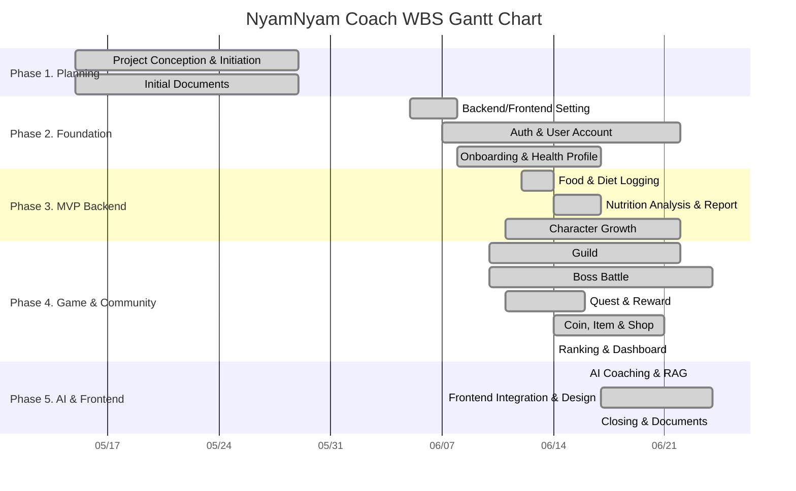

# 냠냠코치 WBS Gantt Chart

작성 기준: `2026-06-24`, `develop` HEAD `3be3373`

Git 작성자명 중 `고예린`, `kyr0686`, `nenini`는 모두 동일 담당자인 `고예린`으로 통합했습니다. 아래 WBS는 전체 브랜치와 커밋 이력을 바탕으로 제출용 표 형식으로 정리했습니다.

## 1. Team Role Summary

| Team Member | Git Author 기준 | Main Role |
| --- | --- | --- |
| 강민수 | `강민수 <kangms2023@naver.com>` | 인증/사용자, 건강 프로필, 음식/식단, 영양 분석, 캐릭터 성장, AI/GMS/RAG, 프론트 API 통합, 최종 문서화 |
| 고예린 | `고예린 <kyr0686@naver.com>`, `kyr0686 <kyr0686@naver.com>`, `nenini <kyr068600@gmail.com>` | 프로젝트 초기 세팅, 프론트 초기/디자인, 길드, 보스전, 퀘스트/보상, 코인/아이템/상점, 랭킹/대시보드, UI/API 보정 |

## 2. WBS Gantt Table

범례: `■` 작업 진행 기간, `완료율`은 최종 `develop` 반영 기준입니다.

| WBS Number | Task Title | Task Owner | Start Date | Due Date | Duration | % Complete | W1 5/15-5/21 | W2 5/22-5/28 | W3 5/29-6/4 | W4 6/5-6/11 | W5 6/12-6/18 | W6 6/19-6/25 |
| --- | --- | --- | --- | --- | ---: | ---: | :---: | :---: | :---: | :---: | :---: | :---: |
| 1 | Project Conception & Initiation | 고예린 | 2026-05-15 | 2026-05-29 | 15d | 100% | ■ | ■ | ■ |  |  |  |
| 1.1 | 초기 기획서 및 유저 플로우 작성 | 고예린 | 2026-05-15 | 2026-05-15 | 1d | 100% | ■ |  |  |  |  |  |
| 1.2 | 기능 목록 정리 | 고예린 | 2026-05-22 | 2026-05-22 | 1d | 100% |  | ■ |  |  |  |  |
| 1.3 | 와이어프레임 작성 | 고예린 | 2026-05-22 | 2026-05-22 | 1d | 100% |  | ■ |  |  |  |  |
| 1.4 | 배치관통 README 작성 | 고예린 | 2026-05-29 | 2026-05-29 | 1d | 100% |  |  | ■ |  |  |  |
| 2 | Project Foundation | 고예린 | 2026-06-05 | 2026-06-08 | 4d | 100% |  |  |  | ■ |  |  |
| 2.1 | 백엔드 기본 구조 생성 | 고예린 | 2026-06-05 | 2026-06-05 | 1d | 100% |  |  |  | ■ |  |  |
| 2.2 | 공통 예외 코드와 폴더 구조 정리 | 고예린 | 2026-06-05 | 2026-06-05 | 1d | 100% |  |  |  | ■ |  |  |
| 2.3 | 로컬 설정 및 gitignore 정리 | 고예린 | 2026-06-05 | 2026-06-05 | 1d | 100% |  |  |  | ■ |  |  |
| 2.4 | 프론트엔드 초기 설정 | 고예린 | 2026-06-08 | 2026-06-08 | 1d | 100% |  |  |  | ■ |  |  |
| 3 | Auth & User Account | 강민수 | 2026-06-07 | 2026-06-22 | 16d | 100% |  |  |  | ■ | ■ | ■ |
| 3.1 | 인증 DB 스키마 및 저장소 구현 | 강민수 | 2026-06-07 | 2026-06-07 | 1d | 100% |  |  |  | ■ |  |  |
| 3.2 | 인증 API 구현 | 강민수 | 2026-06-07 | 2026-06-08 | 2d | 100% |  |  |  | ■ |  |  |
| 3.3 | 사용자 계정 API 구현 | 강민수 | 2026-06-08 | 2026-06-09 | 2d | 100% |  |  |  | ■ |  |  |
| 3.4 | 비밀번호 변경 API 구현 | 강민수 | 2026-06-10 | 2026-06-10 | 1d | 100% |  |  |  | ■ |  |  |
| 3.5 | Google OAuth 구현 | 고예린 | 2026-06-22 | 2026-06-22 | 1d | 100% |  |  |  |  |  | ■ |
| 4 | Onboarding & Health Profile | 강민수 | 2026-06-08 | 2026-06-17 | 10d | 100% |  |  |  | ■ | ■ |  |
| 4.1 | 건강 프로필 스키마 확장 | 강민수 | 2026-06-08 | 2026-06-09 | 2d | 100% |  |  |  | ■ |  |  |
| 4.2 | 온보딩 및 건강 프로필 API | 강민수 | 2026-06-10 | 2026-06-10 | 1d | 100% |  |  |  | ■ |  |  |
| 4.3 | 영양 기준 및 목표 산출 | 강민수 | 2026-06-17 | 2026-06-17 | 1d | 100% |  |  |  |  | ■ |  |
| 5 | Food & Diet Logging | 강민수 | 2026-06-12 | 2026-06-14 | 3d | 100% |  |  |  |  | ■ |  |
| 5.1 | 음식 DB 스키마 및 시드 구성 | 강민수 | 2026-06-12 | 2026-06-13 | 2d | 100% |  |  |  |  | ■ |  |
| 5.2 | 음식 검색 API 구현 | 강민수 | 2026-06-12 | 2026-06-13 | 2d | 100% |  |  |  |  | ■ |  |
| 5.3 | 음식 검색 품질 개선 | 강민수 | 2026-06-13 | 2026-06-13 | 1d | 100% |  |  |  |  | ■ |  |
| 5.4 | 식단 핵심 API 구현 | 강민수 | 2026-06-13 | 2026-06-13 | 1d | 100% |  |  |  |  | ■ |  |
| 6 | Nutrition Analysis & Report | 강민수 | 2026-06-14 | 2026-06-17 | 4d | 100% |  |  |  |  | ■ |  |
| 6.1 | 일별 영양 분석 API 구현 | 강민수 | 2026-06-14 | 2026-06-14 | 1d | 100% |  |  |  |  | ■ |  |
| 6.2 | 코치 API와 끼니 피드백 구현 | 강민수 | 2026-06-14 | 2026-06-14 | 1d | 100% |  |  |  |  | ■ |  |
| 6.3 | AI 리포트 및 분석 화면 조립 API | 강민수 | 2026-06-14 | 2026-06-14 | 1d | 100% |  |  |  |  | ■ |  |
| 6.4 | 또래 비교 인사이트 API | 강민수 | 2026-06-17 | 2026-06-17 | 1d | 100% |  |  |  |  | ■ |  |
| 6.5 | 분석 화면 UI 수정 | 고예린 | 2026-06-17 | 2026-06-17 | 1d | 100% |  |  |  |  | ■ |  |
| 7 | Character Growth | 강민수 | 2026-06-11 | 2026-06-22 | 12d | 100% |  |  |  | ■ | ■ | ■ |
| 7.1 | 캐릭터 조회 및 성장 API | 강민수 | 2026-06-11 | 2026-06-11 | 1d | 100% |  |  |  | ■ |  |  |
| 7.2 | 캐릭터 진화 단계 정리 | 강민수 | 2026-06-11 | 2026-06-11 | 1d | 100% |  |  |  | ■ |  |  |
| 7.3 | 식단 기반 캐릭터 성장/상태 변화 | 강민수 | 2026-06-22 | 2026-06-22 | 1d | 100% |  |  |  |  |  | ■ |
| 8 | Guild | 고예린 | 2026-06-10 | 2026-06-22 | 13d | 100% |  |  |  | ■ | ■ | ■ |
| 8.1 | 길드 기본 스키마 추가 | 고예린 | 2026-06-10 | 2026-06-10 | 1d | 100% |  |  |  | ■ |  |  |
| 8.2 | 길드 기본/관리 API 구현 | 고예린 | 2026-06-10 | 2026-06-10 | 1d | 100% |  |  |  | ■ |  |  |
| 8.3 | 길드 가입 요청 API 구현 | 고예린 | 2026-06-10 | 2026-06-10 | 1d | 100% |  |  |  | ■ |  |  |
| 8.4 | 길드 채팅 API 구현 | 고예린 | 2026-06-13 | 2026-06-14 | 2d | 100% |  |  |  |  | ■ |  |
| 8.5 | 길드 홈/API 연동 수정 | 고예린 | 2026-06-22 | 2026-06-22 | 1d | 100% |  |  |  |  |  | ■ |
| 9 | Boss Battle | 고예린 | 2026-06-10 | 2026-06-24 | 15d | 100% |  |  |  | ■ | ■ | ■ |
| 9.1 | 보스 마스터 API 구현 | 고예린 | 2026-06-10 | 2026-06-11 | 2d | 100% |  |  |  | ■ |  |  |
| 9.2 | 보스전 기본 기능 구현 | 고예린 | 2026-06-11 | 2026-06-13 | 3d | 100% |  |  |  | ■ | ■ |  |
| 9.3 | 보스전 난이도/데미지 밸런스 | 고예린 | 2026-06-13 | 2026-06-13 | 1d | 100% |  |  |  |  | ■ |  |
| 9.4 | 보스전 참여자 스냅샷 정책 | 고예린 | 2026-06-15 | 2026-06-15 | 1d | 100% |  |  |  |  | ■ |  |
| 9.5 | 보스 화면 개선 | 고예린, 강민수 | 2026-06-23 | 2026-06-24 | 2d | 100% |  |  |  |  |  | ■ |
| 10 | Quest & Reward | 고예린 | 2026-06-11 | 2026-06-16 | 6d | 100% |  |  |  | ■ | ■ |  |
| 10.1 | 퀘스트 조회/생성 API 구현 | 고예린 | 2026-06-11 | 2026-06-11 | 1d | 100% |  |  |  | ■ |  |  |
| 10.2 | 퀘스트 템플릿 구조 적용 | 고예린 | 2026-06-11 | 2026-06-15 | 5d | 100% |  |  |  | ■ | ■ |  |
| 10.3 | 식단 기반 퀘스트 검증 및 보상 | 고예린 | 2026-06-14 | 2026-06-14 | 1d | 100% |  |  |  |  | ■ |  |
| 10.4 | 퀘스트/공통 조건 자동 검증 | 고예린 | 2026-06-15 | 2026-06-15 | 1d | 100% |  |  |  |  | ■ |  |
| 10.5 | AI 퀘스트 개인화 | 강민수 | 2026-06-16 | 2026-06-16 | 1d | 100% |  |  |  |  | ■ |  |
| 11 | Coin, Item & Shop | 고예린 | 2026-06-14 | 2026-06-21 | 8d | 100% |  |  |  |  | ■ | ■ |
| 11.1 | 코인 도메인 및 거래 API | 고예린 | 2026-06-14 | 2026-06-14 | 1d | 100% |  |  |  |  | ■ |  |
| 11.2 | 아이템 보유/장착 API | 고예린 | 2026-06-14 | 2026-06-14 | 1d | 100% |  |  |  |  | ■ |  |
| 11.3 | 상점 조회/구매 API | 고예린 | 2026-06-14 | 2026-06-21 | 8d | 100% |  |  |  |  | ■ | ■ |
| 12 | Ranking & Dashboard | 고예린 | 2026-06-14 | 2026-06-14 | 1d | 100% |  |  |  |  | ■ |  |
| 12.1 | 길드 점수 로그 구현 | 고예린 | 2026-06-14 | 2026-06-14 | 1d | 100% |  |  |  |  | ■ |  |
| 12.2 | 길드/보스전 대시보드 | 고예린 | 2026-06-14 | 2026-06-14 | 1d | 100% |  |  |  |  | ■ |  |
| 12.3 | 주간/보스별 랭킹 | 고예린 | 2026-06-14 | 2026-06-14 | 1d | 100% |  |  |  |  | ■ |  |
| 13 | AI Coaching & RAG | 강민수 | 2026-06-16 | 2026-06-16 | 1d | 100% |  |  |  |  | ■ |  |
| 13.1 | GMS AI 연동 | 강민수 | 2026-06-16 | 2026-06-16 | 1d | 100% |  |  |  |  | ■ |  |
| 13.2 | RAG 기반 주간 건강 리포트 | 강민수 | 2026-06-16 | 2026-06-16 | 1d | 100% |  |  |  |  | ■ |  |
| 14 | Frontend Integration & Design | 강민수, 고예린 | 2026-06-17 | 2026-06-24 | 8d | 100% |  |  |  |  | ■ | ■ |
| 14.1 | API 연동 공통 세팅 | 고예린 | 2026-06-17 | 2026-06-17 | 1d | 100% |  |  |  |  | ■ |  |
| 14.2 | 프론트엔드 API 연동 | 강민수 | 2026-06-21 | 2026-06-21 | 1d | 100% |  |  |  |  |  | ■ |
| 14.3 | UI/API 통합 수정 | 고예린 | 2026-06-22 | 2026-06-22 | 1d | 100% |  |  |  |  |  | ■ |
| 14.4 | 디자인 리소스 및 화면 개선 | 고예린 | 2026-06-23 | 2026-06-23 | 1d | 100% |  |  |  |  |  | ■ |
| 15 | Closing & Documents | 강민수 | 2026-06-24 | 2026-06-24 | 1d | 100% |  |  |  |  |  | ■ |
| 15.1 | 불필요 테이블 정리 | 고예린 | 2026-06-24 | 2026-06-24 | 1d | 100% |  |  |  |  |  | ■ |
| 15.2 | 설계 문서 및 클래스 다이어그램 작성 | 강민수 | 2026-06-24 | 2026-06-24 | 1d | 100% |  |  |  |  |  | ■ |
| 15.3 | 요구사항 정의서 작성/수정 | 강민수 | 2026-06-24 | 2026-06-24 | 1d | 100% |  |  |  |  |  | ■ |

## 3. Mermaid Gantt Chart

## 4. Milestone

| Milestone | Goal | Completion Criteria | Related WBS | Status |
| --- | --- | --- | --- | --- |
| M1 | 프로젝트 기반 구축 | Backend/Frontend 실행 가능한 초기 구조 확보 | 1.0, 2.0 | 완료 |
| M2 | MVP 계정/온보딩 완성 | 회원가입부터 건강 프로필 등록까지 가능 | 3.0, 4.0 | 완료 |
| M3 | 식단 기록/분석 완성 | 음식 검색, 식단 CRUD, 일별 분석 제공 | 5.0, 6.0 | 완료 |
| M4 | 캐릭터 성장 루프 완성 | 식단 기록이 캐릭터 경험치/상태에 반영 | 7.0 | 완료 |
| M5 | 협동/보상 콘텐츠 완성 | 길드, 보스전, 퀘스트, 보상, 랭킹 동작 | 8.0 ~ 12.0 | 완료 |
| M6 | AI 코칭 완성 | 일일 피드백, 리포트, RAG 주간 리포트 제공 | 13.0 | 완료 |
| M7 | 프론트 통합 및 시연 정리 | 주요 화면 API 연동, 디자인, 문서 정리 | 14.0, 15.0 | 완료 |

## 5. Final Role Assignment

| Team Member | Final Responsibility |
| --- | --- |
| 강민수 | 인증/사용자/건강 프로필, 음식·식단·영양 분석, 캐릭터 성장, AI 코칭·리포트·RAG, 프론트 API 통합, 요구사항/설계 문서 |
| 고예린 | 초기 프로젝트 세팅, 프론트 초기 화면·디자인, 길드/보스전/퀘스트/보상, 코인·아이템·상점, 랭킹·대시보드, UI/API 보정 |
