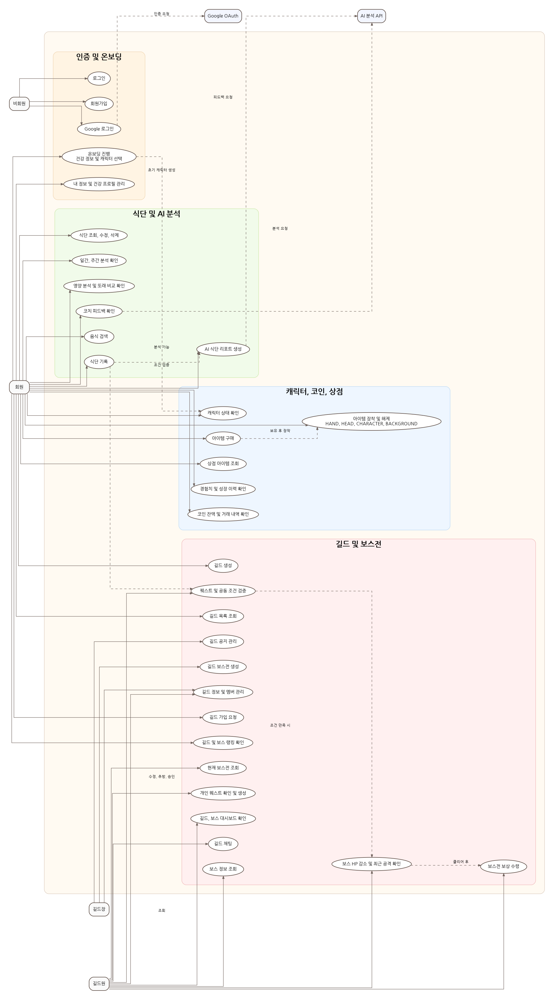
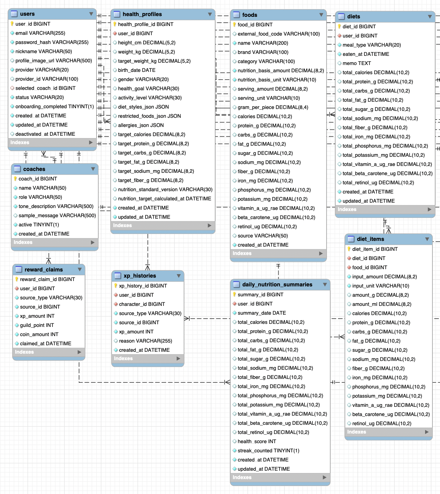
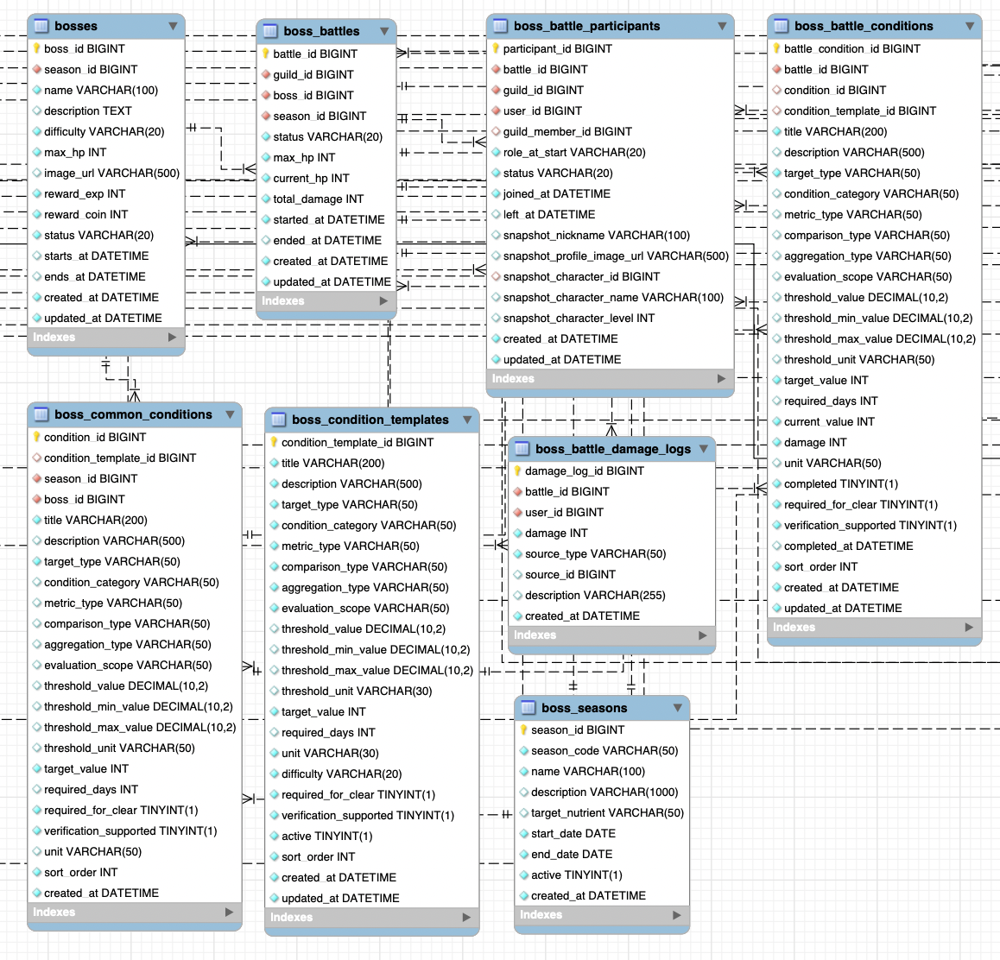
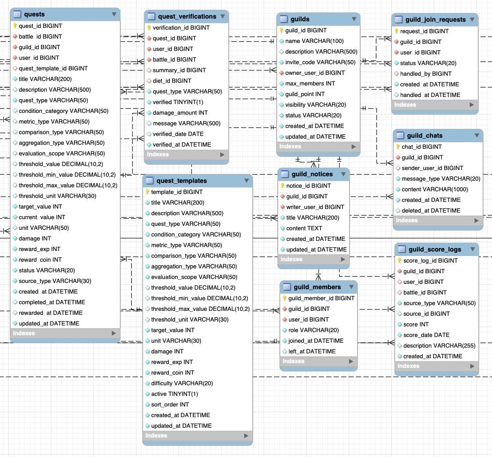
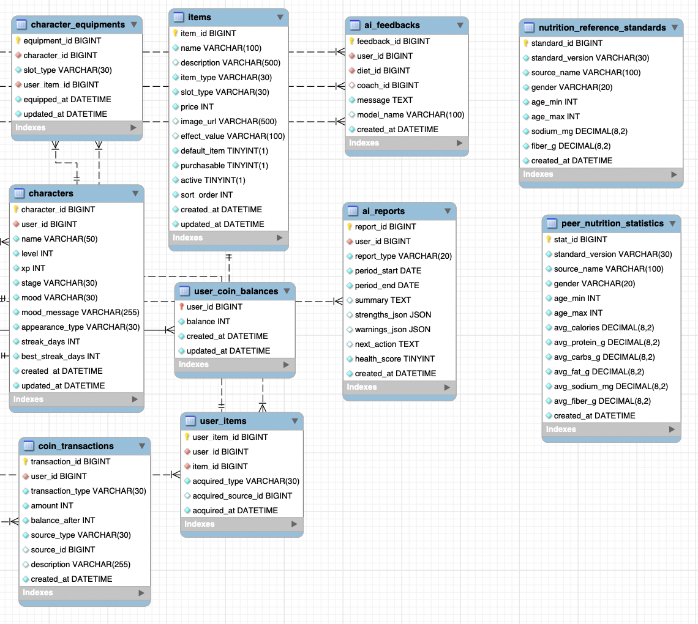

# 다이어그램 문서

## 1. Use-Case 다이어그램

### 1.1 Use-Case 다이어그램 개요

냠냠코치의 Use-Case 다이어그램은 사용자가 서비스에서 수행할 수 있는 주요 기능을 사용자 관점에서 정리한 것이다.

주요 액터는 비회원, 회원, 길드원, 길드장, Google OAuth, AI 분석 API로 구성된다.  
비회원은 회원가입과 로그인을 수행할 수 있으며, 회원은 식단 기록, AI 분석, 캐릭터 성장, 상점 이용 등의 기능을 사용할 수 있다.  
길드원은 길드 가입 이후 보스전 참여, 개인 퀘스트 수행, 공동 조건 검증, 보상 수령 등의 기능을 수행한다.  
길드장은 길드 생성, 길드 정보 관리, 길드 공지 관리, 길드 보스전 생성 등의 기능을 수행한다.

Google OAuth는 소셜 로그인 인증을 담당하며, AI 분석 API는 식단 리포트 생성, 영양 분석, 코치 피드백 생성 과정에서 활용된다.

### 1.2 Use-Case 다이어그램

### 1.3 주요 Use-Case 설명

| 액터         | 주요 기능                                                         | 설명                                                                       |
| ------------ | ----------------------------------------------------------------- | -------------------------------------------------------------------------- |
| 비회원       | 회원가입, 로그인, Google 로그인                                   | 서비스 이용 전 계정을 생성하거나 로그인한다.                               |
| 회원         | 온보딩 진행, 식단 기록, AI 분석 확인, 캐릭터 상태 확인, 상점 이용 | 식단 기록과 분석 결과를 기반으로 건강 상태를 확인하고 캐릭터를 성장시킨다. |
| 길드원       | 길드 정보 확인, 보스전 참여, 퀘스트 검증, 보상 수령               | 길드에 참여해 공동 조건을 달성하고 보스전 보상을 획득한다.                 |
| 길드장       | 길드 생성, 길드 관리, 길드 보스전 생성                            | 길드를 운영하고 보스전을 생성한다.                                         |
| Google OAuth | Google 로그인 인증                                                | Google 계정을 통한 소셜 로그인을 지원한다.                                 |
| AI 분석 API  | 식단 분석, 코치 피드백 생성                                       | 식단 데이터를 기반으로 AI 분석 결과와 피드백을 제공한다.                   |

---

## 2. 클래스 다이어그램

### 2.1 클래스 다이어그램 개요

클래스 다이어그램은 냠냠코치의 주요 도메인 객체와 관계를 표현한 것이다.

프로젝트의 핵심 도메인은 사용자, 건강 프로필, 식단, 분석 리포트, 캐릭터, 아이템, 길드, 보스전으로 구성된다.  
사용자는 건강 프로필을 등록하고 식단을 기록하며, 식단 기록과 분석 결과를 통해 캐릭터 경험치와 보상을 획득한다.  
또한 사용자는 길드에 가입해 보스전에 참여하고, 상점에서 아이템을 구매해 캐릭터에 장착할 수 있다.

### 2.2 클래스 다이어그램

### 2.3 주요 클래스 설명

| 클래스              | 설명                                                                    |
| ------------------- | ----------------------------------------------------------------------- |
| User                | 서비스 사용자의 기본 계정 정보를 관리한다.                              |
| HealthProfile       | 사용자의 건강 정보와 목표 정보를 관리한다.                              |
| Diet                | 사용자가 기록한 식단 정보를 관리한다.                                   |
| DailyReport         | 식단 기록 기반 AI 분석 결과와 건강 점수를 관리한다.                     |
| Character           | 사용자의 캐릭터 상태, 레벨, 경험치, 외형 정보를 관리한다.               |
| Item                | 상점에서 판매되는 장비, 캐릭터 스킨, 배경 스킨 정보를 관리한다.         |
| UserItem            | 사용자가 구매하거나 보유한 아이템 정보를 관리한다.                      |
| CharacterEquipment  | 캐릭터에 장착된 HAND, HEAD, CHARACTER, BACKGROUND 슬롯 정보를 관리한다. |
| Guild               | 길드 기본 정보와 길드장을 관리한다.                                     |
| GuildMember         | 길드에 소속된 사용자와 역할 정보를 관리한다.                            |
| Boss                | 난이도별 보스 정보를 관리한다.                                          |
| BossBattle          | 길드별 보스전 진행 상태와 HP 정보를 관리한다.                           |
| BossBattleDamageLog | 보스 HP 감소 이력과 최근 공격 로그를 관리한다.                          |
| Quest               | 개인 퀘스트와 조건 검증 정보를 관리한다.                                |

---

## 3. ERD

### 3.1 ERD 개요

ERD는 냠냠코치의 최종 데이터베이스 구조를 표현한 것이다.  
본 ERD는 최종 DB 초기화 스크립트인 `init.sql`을 기준으로 작성하였다.

냠냠코치의 데이터베이스는 사용자 및 건강 정보, 식단 및 영양 데이터, 길드와 퀘스트, 보스전, 캐릭터와 상점, AI 분석 데이터로 구성된다.

사용자는 회원가입과 온보딩을 통해 기본 정보와 건강 프로필을 등록하고, 식단을 기록한다.  
기록된 식단은 음식 데이터와 연결되며, 일일 영양 요약과 건강 점수 산출에 활용된다.  
사용자는 길드에 가입해 퀘스트와 보스전에 참여할 수 있고, 보스전 참여 과정에서 조건 검증, 데미지 로그, 보상 수령 이력이 관리된다.  
또한 캐릭터, 아이템, 코인, 장착 정보가 별도로 관리되어 게임형 사용자 경험을 제공한다.  
AI 분석 영역에서는 식단 기반 리포트, 피드백, 영양 기준, 또래 영양 통계 데이터를 관리한다.

---

### 3.2 전체 ERD

전체 ERD는 냠냠코치의 모든 주요 테이블과 관계를 한눈에 확인할 수 있도록 구성한 다이어그램이다.

---

### 3.3 ERD 1: 사용자, 건강 프로필, 식단, 영양 요약 영역

ERD 1은 사용자 계정, 건강 프로필, 음식 데이터, 식단 기록, 식단 상세 항목, 일일 영양 요약, 보상 수령, 경험치 이력과 관련된 테이블 구조를 나타낸다.

사용자는 온보딩 과정에서 건강 프로필을 등록하고, 식단을 기록한다.  
식단은 여러 음식 항목으로 구성될 수 있으며, 각 음식 항목은 식단 상세 테이블을 통해 식단과 연결된다.  
기록된 식단 데이터는 일일 영양 요약과 건강 점수 계산에 활용된다.  
또한 특정 활동에 따라 보상 수령 이력과 경험치 획득 이력이 저장된다.

#### 주요 테이블

| 테이블 | 설명 |
|---|---|
| users | 사용자 계정, 로그인 정보, 프로필 이미지, 온보딩 완료 여부, 선택 코치 정보를 저장한다. |
| health_profiles | 사용자의 키, 몸무게, 목표 체중, 생년월일, 성별, 건강 목표, 활동 수준, 식단 스타일, 제한 음식, 알레르기, 권장 영양 목표를 저장한다. |
| coaches | 온보딩 또는 코칭에서 사용할 코치 정보를 저장한다. |
| foods | 음식명, 브랜드, 카테고리, 1회 제공량, 열량, 단백질, 탄수화물, 지방, 당류, 나트륨 등 음식 영양 정보를 저장한다. |
| diets | 사용자가 기록한 식단의 식사 유형, 섭취 시간, 메모, 총 영양 정보를 저장한다. |
| diet_items | 하나의 식단에 포함된 개별 음식 항목과 해당 섭취량, 영양 정보를 저장한다. |
| daily_nutrition_summaries | 사용자별 일일 총 섭취 열량, 영양소 합계, 건강 점수, 연속 기록 여부를 저장한다. |
| reward_claims | 사용자의 보상 수령 이력을 저장한다. |
| xp_histories | 사용자의 캐릭터 경험치 획득 이력을 저장한다. |

#### 주요 관계

| 관계 | 설명 |
|---|---|
| users 1 : 1 health_profiles | 한 사용자는 하나의 건강 프로필을 가진다. |
| coaches 1 : N users | 하나의 코치는 여러 사용자의 선택 코치가 될 수 있다. |
| users 1 : N diets | 한 사용자는 여러 식단 기록을 작성할 수 있다. |
| diets 1 : N diet_items | 하나의 식단은 여러 음식 항목으로 구성될 수 있다. |
| foods 1 : N diet_items | 하나의 음식 데이터는 여러 식단 상세 항목에서 참조될 수 있다. |
| users 1 : N daily_nutrition_summaries | 한 사용자는 날짜별 일일 영양 요약을 가진다. |
| users 1 : N reward_claims | 한 사용자는 여러 보상 수령 이력을 가질 수 있다. |
| users 1 : N xp_histories | 한 사용자는 여러 경험치 획득 이력을 가질 수 있다. |

---

### 3.4 ERD 2: 보스 시즌, 보스전, 보스 조건 영역

ERD 2는 보스 시즌, 난이도별 보스, 길드 보스전, 보스전 참여자, 보스 공통 조건, 보스 조건 템플릿, 진행 중인 보스전 조건, 보스 데미지 로그와 관련된 테이블 구조를 나타낸다.

보스는 시즌과 난이도 기준으로 관리되며, 길드장은 길드 단위의 보스전을 생성할 수 있다.  
보스전이 생성되면 참여자 정보와 보스전 조건이 저장되고, 길드원이 퀘스트나 공동 조건을 달성하면 보스 HP가 감소한다.  
보스 HP 감소 내역은 데미지 로그로 저장되며, 최근 공격 하이라이트와 공격 이펙트 표시에도 활용된다.

#### 주요 테이블

| 테이블 | 설명 |
|---|---|
| boss_seasons | 보스 시즌 코드, 시즌명, 설명, 목표 영양소, 시작일, 종료일, 활성화 여부를 저장한다. |
| bosses | 시즌별 보스 이름, 설명, 난이도, 최대 HP, 이미지, 보상 경험치, 보상 코인, 진행 상태를 저장한다. |
| boss_battles | 길드별 보스전의 보스, 시즌, 상태, 최대 HP, 현재 HP, 누적 데미지, 시작일, 종료일을 저장한다. |
| boss_battle_participants | 보스전에 참여한 길드원 정보와 참여 당시 닉네임, 프로필, 캐릭터 스냅샷을 저장한다. |
| boss_condition_templates | 보스 조건 템플릿 정보를 저장한다. 조건의 기준 영양소, 비교 방식, 집계 방식, 목표값, 난이도 등을 포함한다. |
| boss_common_conditions | 보스별 공통 격파 조건 정보를 저장한다. |
| boss_battle_conditions | 실제 진행 중인 보스전의 조건 진행 상태를 저장한다. 현재 값, 완료 여부, 데미지, 필수 여부 등을 포함한다. |
| boss_battle_damage_logs | 보스 HP 감소 이력을 저장한다. 공격자, 데미지, 발생 원인, 설명, 생성 시간이 포함된다. |

#### 주요 관계

| 관계 | 설명 |
|---|---|
| boss_seasons 1 : N bosses | 하나의 시즌은 여러 보스를 가질 수 있다. |
| boss_seasons 1 : N boss_battles | 하나의 시즌에서 여러 보스전이 진행될 수 있다. |
| bosses 1 : N boss_battles | 하나의 보스는 여러 길드 보스전에 사용될 수 있다. |
| boss_battles 1 : N boss_battle_participants | 하나의 보스전에는 여러 참여자가 존재할 수 있다. |
| boss_condition_templates 1 : N boss_common_conditions | 하나의 조건 템플릿은 여러 보스 공통 조건으로 사용될 수 있다. |
| bosses 1 : N boss_common_conditions | 하나의 보스는 여러 공통 격파 조건을 가진다. |
| boss_battles 1 : N boss_battle_conditions | 하나의 보스전은 여러 진행 조건을 가진다. |
| boss_battles 1 : N boss_battle_damage_logs | 하나의 보스전에는 여러 데미지 로그가 저장된다. |
| users 1 : N boss_battle_damage_logs | 한 사용자는 여러 보스 공격 이력을 남길 수 있다. |

---

### 3.5 ERD 3: 길드, 퀘스트, 퀘스트 검증 영역

ERD 3은 길드, 길드 멤버, 길드 가입 요청, 길드 공지, 길드 채팅, 길드 점수 로그, 퀘스트, 퀘스트 템플릿, 퀘스트 검증과 관련된 테이블 구조를 나타낸다.

사용자는 길드를 생성하거나 가입 요청을 보낼 수 있으며, 길드에 가입하면 길드원으로 활동한다.  
길드장은 길드 정보와 멤버, 공지를 관리할 수 있다.  
길드원은 보스전과 연결된 개인 퀘스트를 확인하고, 식단 기록을 기반으로 퀘스트 검증을 수행한다.  
퀘스트 검증 결과는 보스전 데미지, 길드 점수, 보상 흐름으로 이어진다.

#### 주요 테이블

| 테이블 | 설명 |
|---|---|
| guilds | 길드명, 설명, 초대 코드, 길드장, 최대 인원, 길드 포인트, 공개 여부, 상태를 저장한다. |
| guild_members | 길드에 소속된 사용자와 역할, 가입일, 탈퇴일을 저장한다. |
| guild_join_requests | 사용자의 길드 가입 요청 상태와 처리자를 저장한다. |
| guild_notices | 길드 공지 제목, 내용, 작성자, 작성일을 저장한다. |
| guild_chats | 길드 채팅 메시지, 발신자, 메시지 유형, 삭제 시간을 저장한다. |
| guild_score_logs | 길드 점수 획득 이력을 저장한다. |
| quest_templates | 퀘스트 생성을 위한 템플릿 정보를 저장한다. 조건 기준, 목표값, 보상, 난이도 등을 포함한다. |
| quests | 사용자별 개인 퀘스트 정보를 저장한다. 보스전, 길드, 사용자, 템플릿, 조건, 현재 값, 보상, 상태를 포함한다. |
| quest_verifications | 퀘스트 검증 결과를 저장한다. 검증 여부, 데미지량, 메시지, 검증 날짜와 시간이 포함된다. |

#### 주요 관계

| 관계 | 설명 |
|---|---|
| users 1 : N guilds | 한 사용자는 길드를 생성할 수 있다. |
| guilds 1 : N guild_members | 하나의 길드는 여러 길드원을 가진다. |
| users 1 : N guild_members | 한 사용자는 길드 멤버로 참여할 수 있다. |
| guilds 1 : N guild_join_requests | 하나의 길드는 여러 가입 요청을 받을 수 있다. |
| users 1 : N guild_join_requests | 한 사용자는 여러 길드 가입 요청을 보낼 수 있다. |
| guilds 1 : N guild_notices | 하나의 길드는 여러 공지를 가진다. |
| guilds 1 : N guild_chats | 하나의 길드는 여러 채팅 메시지를 가진다. |
| guilds 1 : N guild_score_logs | 하나의 길드는 여러 점수 이력을 가진다. |
| quest_templates 1 : N quests | 하나의 퀘스트 템플릿은 여러 개인 퀘스트 생성에 사용될 수 있다. |
| users 1 : N quests | 한 사용자는 여러 개인 퀘스트를 가질 수 있다. |
| guilds 1 : N quests | 하나의 길드는 여러 퀘스트와 연결될 수 있다. |
| boss_battles 1 : N quests | 하나의 보스전은 여러 개인 퀘스트와 연결될 수 있다. |
| quests 1 : N quest_verifications | 하나의 퀘스트는 여러 검증 이력을 가질 수 있다. |

---

### 3.6 ERD 4: 캐릭터, 아이템, 코인, AI 분석 기준 영역

ERD 4는 캐릭터, 아이템, 사용자 보유 아이템, 캐릭터 장착 정보, 코인 잔액, 코인 거래 이력, AI 리포트, AI 피드백, 영양 기준, 또래 영양 통계와 관련된 테이블 구조를 나타낸다.

사용자는 캐릭터를 보유하며, 식단 기록과 보상 획득을 통해 경험치와 코인을 얻는다.  
상점에서 구매한 아이템은 사용자 보유 아이템으로 저장되고, 캐릭터에는 슬롯 단위로 장착된다.  
장착 슬롯은 HAND, HEAD, CHARACTER, BACKGROUND로 구분된다.  
AI 분석 영역에서는 사용자별 분석 리포트와 피드백을 저장하고, 영양 기준 및 또래 통계 데이터는 분석 결과와 비교 기준으로 활용된다.

#### 주요 테이블

| 테이블 | 설명 |
|---|---|
| characters | 사용자의 캐릭터 이름, 레벨, 경험치, 성장 단계, 기분, 외형 타입, 연속 기록일 정보를 저장한다. |
| items | 상점 아이템 정보를 저장한다. 아이템 타입, 장착 슬롯, 가격, 이미지, 효과값, 기본 아이템 여부, 구매 가능 여부를 포함한다. |
| user_items | 사용자가 보유한 아이템 정보를 저장한다. 획득 유형, 획득 원천, 획득 시간이 포함된다. |
| character_equipments | 캐릭터에 장착된 아이템 정보를 슬롯별로 저장한다. |
| user_coin_balances | 사용자별 현재 코인 잔액을 저장한다. |
| coin_transactions | 코인 획득 및 사용 이력을 저장한다. 거래 유형, 금액, 잔액, 원천, 설명이 포함된다. |
| ai_reports | 사용자별 AI 분석 리포트를 저장한다. 리포트 유형, 기간, 요약, 강점, 경고, 다음 행동, 건강 점수를 포함한다. |
| ai_feedbacks | 식단과 코치에 연결된 AI 피드백 메시지를 저장한다. |
| nutrition_reference_standards | 성별, 나이대 기준의 권장 영양 기준을 저장한다. |
| peer_nutrition_statistics | 성별, 나이대 기준의 또래 평균 영양 섭취 통계를 저장한다. |

#### 주요 관계

| 관계 | 설명 |
|---|---|
| users 1 : 1 characters | 한 사용자는 하나의 캐릭터를 가진다. |
| characters 1 : N character_equipments | 하나의 캐릭터는 여러 슬롯에 아이템을 장착할 수 있다. |
| users 1 : N user_items | 한 사용자는 여러 아이템을 보유할 수 있다. |
| items 1 : N user_items | 하나의 아이템은 여러 사용자에게 보유될 수 있다. |
| user_items 1 : N character_equipments | 보유 아이템은 캐릭터 장착 정보와 연결된다. |
| users 1 : 1 user_coin_balances | 한 사용자는 하나의 코인 잔액 정보를 가진다. |
| users 1 : N coin_transactions | 한 사용자는 여러 코인 거래 이력을 가진다. |
| users 1 : N ai_reports | 한 사용자는 여러 AI 분석 리포트를 가질 수 있다. |
| users 1 : N ai_feedbacks | 한 사용자는 여러 AI 피드백을 받을 수 있다. |
| diets 1 : N ai_feedbacks | 하나의 식단 기록은 여러 AI 피드백과 연결될 수 있다. |
| coaches 1 : N ai_feedbacks | 하나의 코치는 여러 AI 피드백과 연결될 수 있다. |
---

## 4. 다이어그램 정리

본 문서의 다이어그램은 냠냠코치의 핵심 기능을 설계 관점에서 표현한다.

| 다이어그램          | 목적                                                          |
| ------------------- | ------------------------------------------------------------- |
| Use-Case 다이어그램 | 사용자와 외부 시스템이 냠냠코치에서 수행하는 기능을 표현한다. |
| 클래스 다이어그램   | 주요 도메인 객체와 클래스 간 관계를 표현한다.                 |
| 전체 ERD            | 전체 데이터베이스 구조와 테이블 관계를 표현한다.              |
| ERD 1               | 사용자, 건강 프로필, 식단, 분석 도메인을 상세 표현한다.       |
| ERD 2               | 캐릭터, 코인, 상점, 장착 도메인을 상세 표현한다.              |
| ERD 3               | 길드 도메인을 상세 표현한다.                                  |
| ERD 4               | 보스전, 퀘스트, 보상 도메인을 상세 표현한다.                  |
