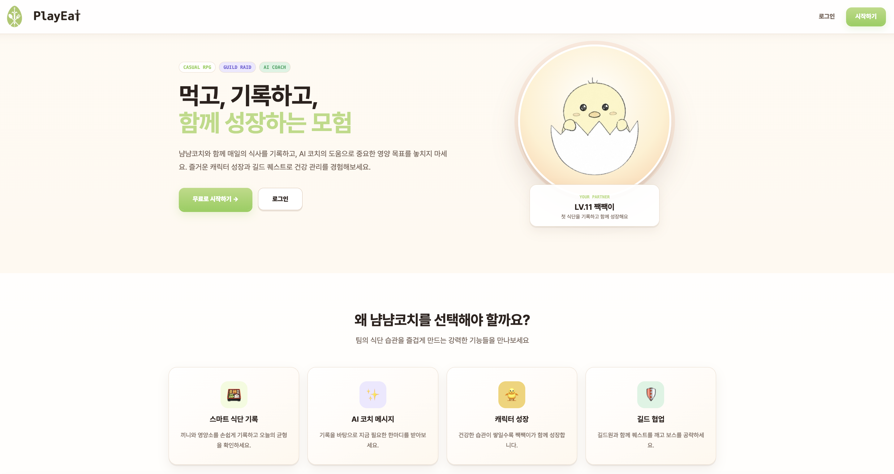
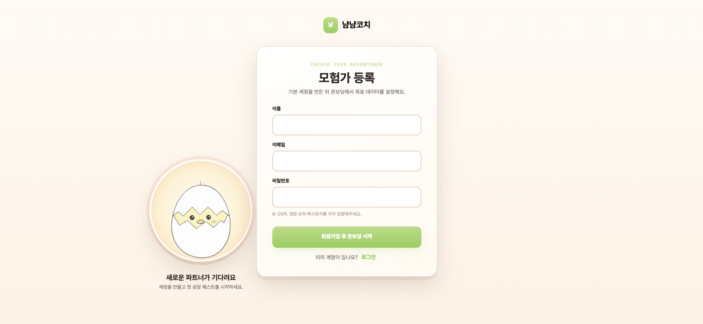
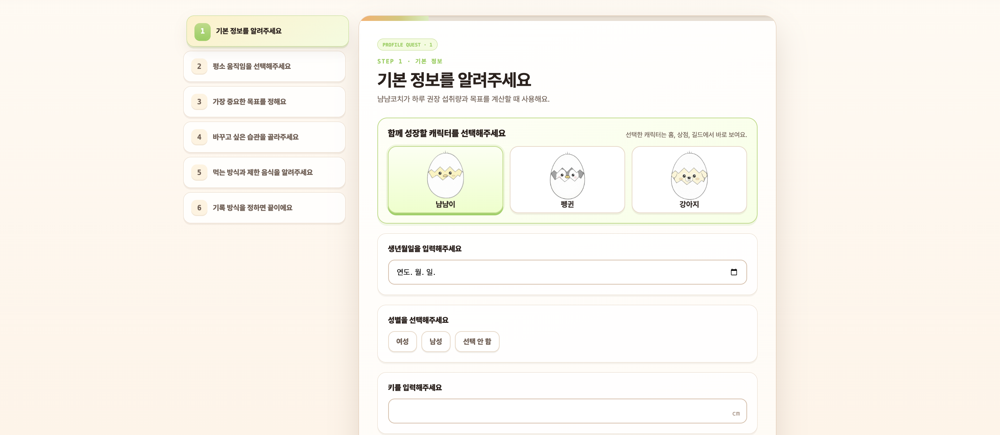
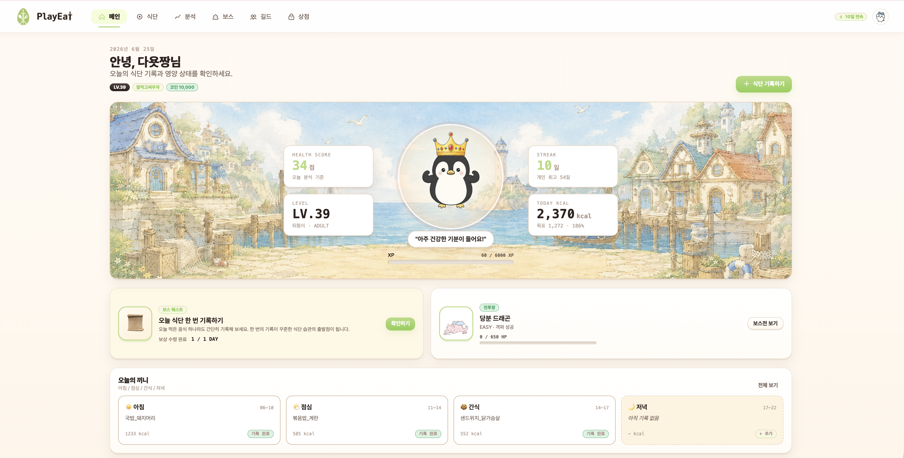
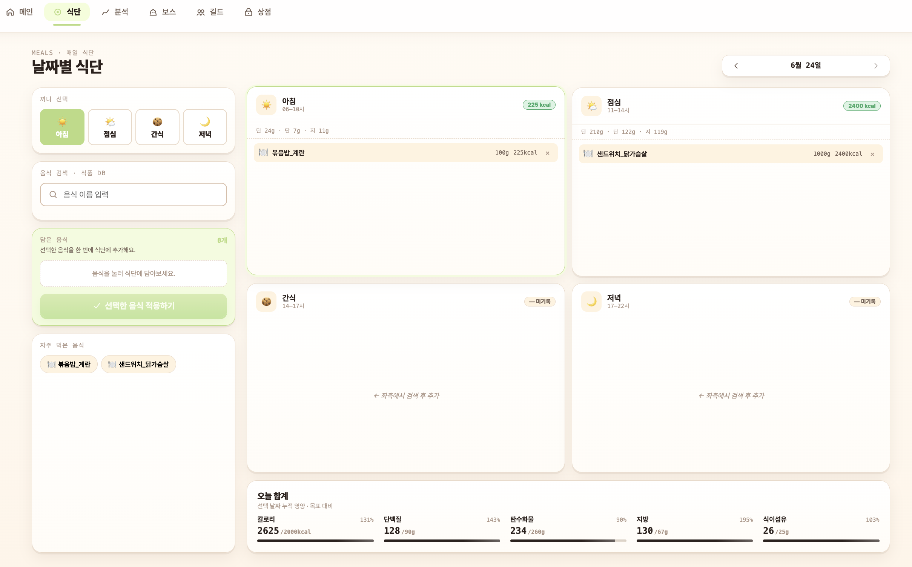
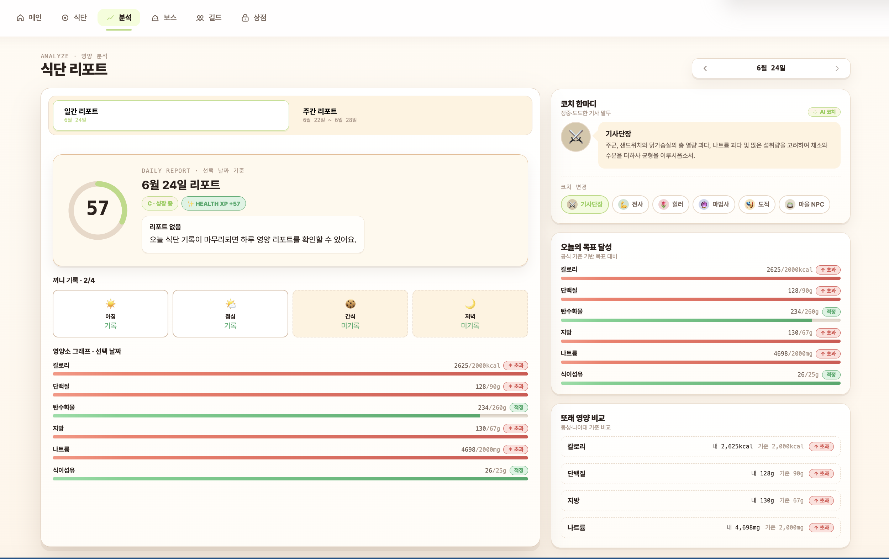
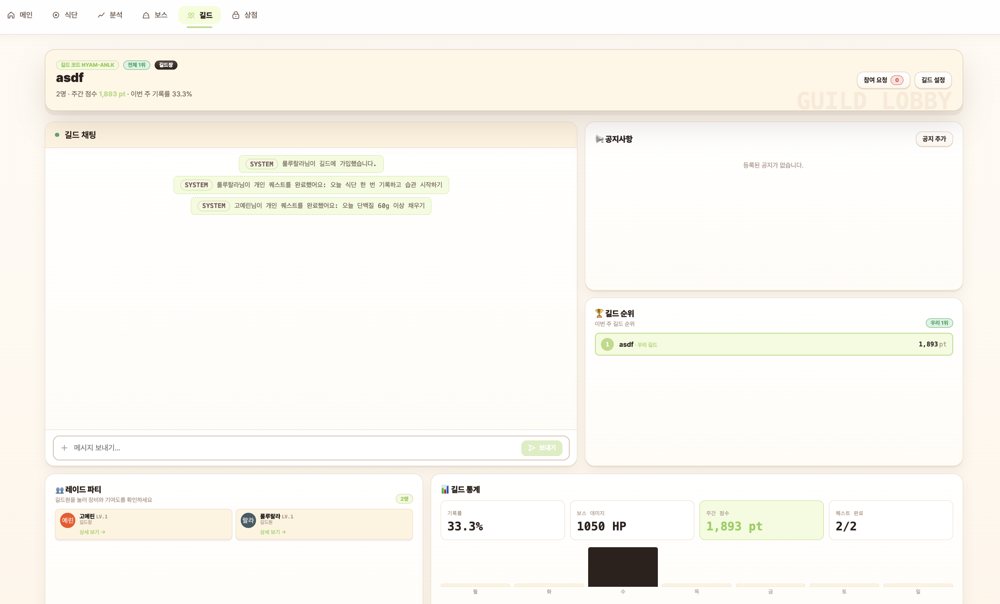
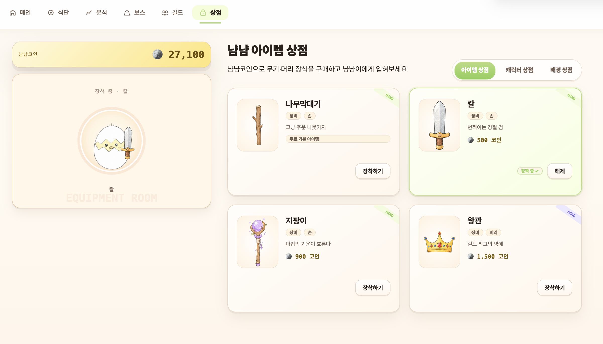
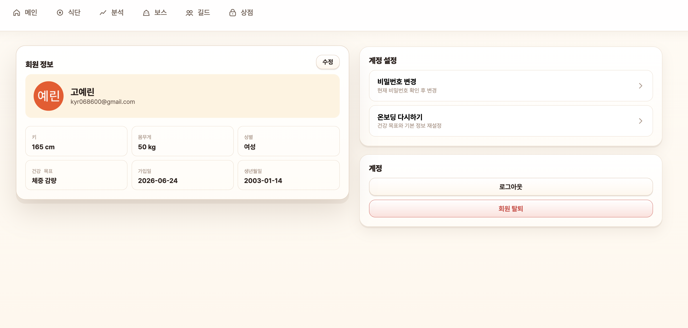

# 화면 설계서

## 1. 화면 설계서 개요

본 화면 설계서는 PlayEat 서비스의 최종 구현 화면을 기준으로 작성한 문서이다.

PlayEat는 사용자가 매일 식단을 기록하고, AI 기반 영양 분석을 확인하며, 캐릭터 성장, 상점, 길드, 보스전 기능을 통해 건강한 식습관을 게임처럼 지속할 수 있도록 돕는 서비스이다.

최종 구현 화면은 시작 화면, 인증 화면, 온보딩 화면, 메인 화면, 식단 화면, 분석 화면, 길드 화면, 보스전 화면, 상점 화면, 마이페이지로 구성된다.

---

## 2. 전체 화면 목록

| 화면 ID | 화면명 | 파일명 | 설명 |
|---|---|---|---|
| UI-001 | 시작 페이지 | StartPage.vue | 서비스 소개, 핵심 기능 안내, 시작하기 및 로그인 진입 |
| UI-002 | 로그인 페이지 | LoginPage.vue | 이메일 로그인 및 Google 로그인 |
| UI-003 | 회원가입 페이지 | SignupPage.vue | 신규 사용자 계정 생성 |
| UI-004 | 온보딩 페이지 | OnboardingPage.vue | 건강 정보 입력, 코치 설정, 초기 캐릭터 선택 |
| UI-005 | 메인 페이지 | HomePage.vue | 캐릭터, 건강 점수, 끼니 기록, 퀘스트, 보스 요약 확인 |
| UI-006 | 식단 페이지 | MealsPage.vue | 음식 검색, 식단 기록, 식단 조회, 일일 영양 합계 확인 |
| UI-007 | 분석 페이지 | AnalyzePage.vue | 일간, 주간 AI 식단 리포트와 코치 피드백 확인 |
| UI-008 | 길드 페이지 | GuildPage.vue | 길드 목록, 길드 생성, 가입 요청, 길드 활동, 길드원 상세 확인 |
| UI-009 | 보스전 페이지 | BossPage.vue | 길드 보스전, HP, 조건, 공격 이펙트, 보상 확인 |
| UI-010 | 상점 페이지 | ShopPage.vue | 장비, 캐릭터, 배경 아이템 구매 및 장착 |
| UI-011 | 마이페이지 | MyPage.vue | 회원 정보, 프로필 이미지, 건강 정보, 계정 설정 관리 |

---

## 3. 전체 사용자 흐름

### 3.1 신규 사용자 흐름

```text
시작 페이지
→ 회원가입
→ 온보딩
→ 초기 캐릭터 선택
→ 건강 정보 입력
→ 메인 페이지
```

### 3.2 일반 식단 기록 흐름

```text
로그인
→ 메인 페이지
→ 식단 페이지
→ 음식 검색
→ 식단 기록
→ 일일 영양 합계 확인
→ 분석 페이지
→ AI 리포트 및 코치 피드백 확인
```

### 3.3 캐릭터 성장 및 상점 흐름

```text
식단 기록
→ 건강 점수 및 경험치 획득
→ 메인 페이지에서 캐릭터 성장 확인
→ 상점 페이지
→ 아이템 구매
→ HAND, HEAD, CHARACTER, BACKGROUND 장착
→ 메인 페이지에서 변경된 캐릭터 확인
```

### 3.4 길드 및 보스전 흐름

```text
메인 페이지
→ 길드 페이지
→ 길드 생성 또는 가입 요청
→ 길드 참여
→ 보스전 페이지
→ 식단 기록으로 퀘스트 조건 달성
→ 보스 HP 감소
→ 공격 이펙트 및 최근 공격 로그 확인
→ 보스 클리어
→ 보상 수령
```

---

## 4. 공통 레이아웃

PlayEat의 로그인 이후 주요 화면은 공통 레이아웃인 AppShell을 기반으로 구성된다.

### 4.1 상단 내비게이션

| 메뉴 | 연결 화면 | 설명 |
|---|---|---|
| 메인 | HomePage.vue | 오늘의 건강 상태와 캐릭터 현황 확인 |
| 식단 | MealsPage.vue | 식단 기록 및 조회 |
| 분석 | AnalyzePage.vue | AI 기반 영양 분석 확인 |
| 보스 | BossPage.vue | 길드 보스전 확인 |
| 길드 | GuildPage.vue | 길드 활동 및 관리 |
| 상점 | ShopPage.vue | 아이템 구매 및 장착 |
| 마이페이지 | MyPage.vue | 회원 정보 및 계정 관리 |

### 4.2 공통 UI 특징

| 항목 | 설명 |
|---|---|
| 게임형 UI | 캐릭터, 보스, 아이템, 배경, 이펙트를 활용해 게임처럼 구성 |
| 카드 기반 구성 | 건강 점수, 퀘스트, 보상, 분석 결과를 카드 단위로 표시 |
| 캐릭터 중심 피드백 | 캐릭터 성장, 장착 아이템, 배경 스킨으로 사용자 성취감 제공 |
| 즉각적 피드백 | 식단 기록 후 퀘스트 검증, 보스 HP 감소, 공격 이펙트 표시 |
| 공통 컴포넌트 활용 | AppCard, AppButton, AppPill, CharacterAvatar 등을 재사용 |

---

# 5. 화면별 설계

## 5.1 시작 페이지

### 화면 목적

시작 페이지는 PlayEat의 서비스 컨셉과 핵심 기능을 소개하고, 사용자가 회원가입 또는 로그인으로 진입할 수 있도록 하는 랜딩 화면이다.

### 화면 이미지



### 주요 구성 요소

| 영역 | 설명 |
|---|---|
| 상단 네비게이션 | PlayEat 로고, 로그인, 시작하기 버튼 표시 |
| 히어로 영역 | 서비스 핵심 문구와 시작 버튼 표시 |
| 캐릭터 소개 영역 | 냠냠이 캐릭터와 성장 메시지 표시 |
| 기능 소개 영역 | 스마트 식단 기록, AI 코치 메시지, 캐릭터 성장, 길드 협업 소개 |
| 시작 단계 영역 | 회원가입, 온보딩 설정, 식단 기록 시작 흐름 안내 |
| CTA 영역 | 무료 체험 시작 버튼 제공 |

### 사용자 액션

| 액션 | 결과 |
|---|---|
| 시작하기 클릭 | 회원가입 또는 온보딩 시작 흐름으로 이동 |
| 로그인 클릭 | 로그인 페이지로 이동 |
| 무료 체험 시작 클릭 | 신규 사용자 시작 흐름으로 이동 |

---

## 5.2 로그인 페이지

### 화면 목적

로그인 페이지는 기존 사용자가 이메일 계정 또는 Google 계정을 통해 서비스에 접근할 수 있도록 하는 화면이다.

### 화면 이미지


### 주요 구성 요소

| 영역 | 설명 |
|---|---|
| 이메일 입력 | 사용자 이메일 입력 |
| 비밀번호 입력 | 사용자 비밀번호 입력 |
| 로그인 버튼 | 이메일 기반 로그인 요청 |
| Google 로그인 버튼 | Google OAuth 로그인 요청 |
| 회원가입 이동 | 신규 사용자를 회원가입 페이지로 이동 |

### 사용자 액션

| 액션 | 결과 |
|---|---|
| 이메일과 비밀번호 입력 후 로그인 | JWT 토큰 발급 후 서비스 진입 |
| Google 로그인 클릭 | Google OAuth 인증 후 서비스 진입 |
| 회원가입 클릭 | 회원가입 페이지로 이동 |

### 예외 상황

| 상황 | 처리 |
|---|---|
| 이메일 형식 오류 | 입력값 검증 메시지 표시 |
| 비밀번호 오류 | 로그인 실패 메시지 표시 |
| Google 인증 실패 | 인증 실패 안내 |
| 온보딩 미완료 사용자 | 온보딩 페이지로 이동 |

---

## 5.3 회원가입 페이지

### 화면 목적

회원가입 페이지는 신규 사용자가 이메일, 비밀번호, 닉네임을 입력해 계정을 생성하는 화면이다.

### 화면 이미지



### 주요 구성 요소

| 영역 | 설명 |
|---|---|
| 이메일 입력 | 로그인에 사용할 이메일 입력 |
| 비밀번호 입력 | 비밀번호 입력 |
| 비밀번호 확인 | 비밀번호 재입력 |
| 닉네임 입력 | 서비스에서 사용할 닉네임 입력 |
| 회원가입 버튼 | 계정 생성 요청 |
| 로그인 이동 | 기존 사용자 로그인 페이지로 이동 |

### 사용자 액션

| 액션 | 결과 |
|---|---|
| 회원가입 정보 입력 | 입력값 검증 |
| 회원가입 클릭 | 계정 생성 후 온보딩 페이지로 이동 |
| 로그인 클릭 | 로그인 페이지로 이동 |

### 예외 상황

| 상황 | 처리 |
|---|---|
| 이메일 중복 | 중복 이메일 안내 |
| 비밀번호 조건 미충족 | 비밀번호 조건 안내 |
| 비밀번호 불일치 | 재입력 안내 |
| 닉네임 미입력 | 필수값 안내 |

---

## 5.4 온보딩 페이지

### 화면 목적

온보딩 페이지는 신규 사용자가 서비스 이용에 필요한 건강 정보와 목표를 입력하고, 초기 캐릭터를 선택하는 화면이다.

### 화면 이미지



### 주요 구성 요소

| 영역 | 설명 |
|---|---|
| 단계 목록 | 현재 온보딩 진행 단계 표시 |
| 진행 바 | 전체 온보딩 진행률 표시 |
| 캐릭터 선택 영역 | 냠냠이, 강아지, 펭귄 중 초기 캐릭터 선택 |
| 건강 정보 입력 | 성별, 생년월일, 키, 몸무게 입력 |
| 목표 설정 | 목표 체중, 건강 목표, 활동 수준 입력 |
| 식단 정보 설정 | 식단 스타일, 제한 음식, 알레르기 입력 |
| 이전, 다음 버튼 | 단계 이동 |
| 완료 버튼 | 온보딩 정보 저장 후 메인 진입 |

### 사용자 액션

| 액션 | 결과 |
|---|---|
| 캐릭터 선택 | characters.appearance_type에 초기 캐릭터 반영 |
| 건강 정보 입력 | health_profiles에 건강 정보 저장 |
| 코치 및 목표 설정 | 사용자 맞춤 분석 기준 설정 |
| 완료 클릭 | users.onboarding_completed 상태 변경 |

### 예외 상황

| 상황 | 처리 |
|---|---|
| 필수값 미입력 | 입력 검증 메시지 표시 |
| 숫자 범위 오류 | 허용 범위 안내 |
| 온보딩 저장 실패 | 오류 메시지 및 재시도 안내 |
| 수정 모드 진입 | 기존 건강 프로필을 불러와 수정 가능 |

---

## 5.5 메인 페이지

### 화면 목적

메인 페이지는 사용자가 오늘의 식단 기록 상태, 건강 점수, 캐릭터 성장, 퀘스트, 보스전 요약을 한눈에 확인하는 홈 화면이다.

### 화면 이미지



### 주요 구성 요소

| 영역 | 설명 |
|---|---|
| 인사 영역 | 날짜, 사용자 닉네임, 레벨, 코인, 연속 기록일 표시 |
| 캐릭터 카드 | 현재 캐릭터, 장착 아이템, 배경 스킨, 경험치 표시 |
| 건강 점수 카드 | 오늘 분석 기준 건강 점수 표시 |
| 레벨 카드 | 캐릭터 레벨과 성장 단계 표시 |
| 연속 기록 카드 | 현재 연속 식단 기록일과 최고 기록 표시 |
| 칼로리 카드 | 오늘 섭취 칼로리와 목표 대비 비율 표시 |
| 오늘의 끼니 | 아침, 점심, 간식, 저녁 기록 여부 표시 |
| 퀘스트 카드 | 오늘 수행할 개인 퀘스트 또는 보스 퀘스트 표시 |
| 보스 카드 | 현재 진행 중인 길드 보스전 요약 표시 |

### 사용자 액션

| 액션 | 결과 |
|---|---|
| 식단 기록하기 클릭 | 식단 페이지로 이동 |
| 끼니 카드 클릭 | 식단 페이지로 이동 |
| 퀘스트 확인 클릭 | 보스 또는 퀘스트 관련 화면으로 이동 |
| 보스 카드 클릭 | 보스전 페이지로 이동 |
| 캐릭터 상태 확인 | 현재 성장 상태와 장착 아이템 확인 |

### 연동 데이터

| 데이터 | 설명 |
|---|---|
| 사용자 정보 | 닉네임, 프로필, 레벨, 코인 |
| 캐릭터 정보 | level, xp, stage, mood, appearanceType |
| 장착 아이템 | HAND, HEAD, CHARACTER, BACKGROUND |
| 일일 분석 | 건강 점수, 칼로리, 영양소 요약 |
| 길드 상태 | 가입 길드, 진행 중인 보스전 |
| 퀘스트 상태 | 현재 개인 퀘스트 및 진행도 |

### 예외 상황

| 상황 | 처리 |
|---|---|
| 오늘 식단 기록 없음 | 건강 점수와 칼로리를 기본값 또는 안내 문구로 표시 |
| 장착 아이템 없음 | 기본 캐릭터와 기본 배경 표시 |
| 가입한 길드 없음 | 길드 가입 안내 |
| 진행 중인 보스전 없음 | 보스전 생성 또는 참여 안내 |
| API 조회 실패 | 오류 메시지 표시 |

---

## 5.6 식단 페이지

### 화면 목적

식단 페이지는 사용자가 날짜와 끼니를 선택해 음식을 검색하고, 식단을 기록하며, 선택 날짜의 영양 합계를 확인하는 화면이다.

### 화면 이미지



### 주요 구성 요소

| 영역 | 설명 |
|---|---|
| 날짜 선택 영역 | 이전, 다음 날짜 이동 및 달력 선택 |
| 끼니 선택 영역 | 아침, 점심, 간식, 저녁 선택 |
| 음식 검색 영역 | 음식명 기반 식품 DB 검색 |
| 검색 결과 목록 | 검색된 음식 목록 표시 |
| 담은 음식 영역 | 선택한 음식과 섭취량 조정 |
| 섭취량 입력 | 1회 제공량 또는 g 단위 입력 |
| 자주 먹은 음식 | 사용자가 자주 기록한 음식 표시 |
| 식단 사분면 | 끼니별 기록 현황 표시 |
| 오늘 합계 | 선택 날짜의 총 열량과 영양소 합계 표시 |

### 사용자 액션

| 액션 | 결과 |
|---|---|
| 날짜 선택 | 해당 날짜의 식단 기록 조회 |
| 끼니 선택 | 기록할 식사 유형 선택 |
| 음식 검색 | 음식 데이터 목록 조회 |
| 음식 클릭 | 담은 음식 목록에 추가 |
| 섭취량 조정 | 영양소 값 자동 계산 |
| 식단 저장 | 선택 끼니에 식단 기록 저장 |
| 기존 식단 수정 | 식단 정보 갱신 |
| 식단 삭제 | 기존 기록 삭제 |

### 연동 API

| 기능 | 설명 |
|---|---|
| 음식 검색 | foods 데이터 기반 검색 |
| 식단 생성 | diets 및 diet_items 저장 |
| 식단 조회 | 날짜별 식단 목록 조회 |
| 식단 수정 | 기존 식단 및 식단 상세 갱신 |
| 식단 삭제 | 선택 식단 삭제 |
| 퀘스트 검증 | 식단 기록 이후 퀘스트 및 공동 조건 검증 |

### 예외 상황

| 상황 | 처리 |
|---|---|
| 검색 결과 없음 | 검색 결과 없음 안내 |
| 담은 음식 없음 | 음식을 선택하라는 안내 표시 |
| 섭취량 오류 | 입력값 검증 메시지 표시 |
| 저장 실패 | 오류 메시지 표시 |
| 식단 삭제 실패 | 재시도 안내 |

---

## 5.7 분석 페이지

### 화면 목적

분석 페이지는 사용자의 식단 기록을 기반으로 일간 및 주간 영양 분석 결과를 제공하는 화면이다.

### 화면 이미지



### 주요 구성 요소

| 영역 | 설명 |
|---|---|
| 날짜 선택 영역 | 분석 기준 날짜 선택 |
| 일간 리포트 탭 | 선택 날짜의 건강 점수와 영양 분석 표시 |
| 주간 리포트 탭 | 주간 건강 점수 추이와 주간 분석 표시 |
| 건강 점수 링 | 일간 건강 점수 시각화 |
| 리포트 섹션 | 요약, 강점, 주의사항, 다음 행동 제안 표시 |
| 끼니 기록 상태 | 아침, 점심, 간식, 저녁 기록 여부 표시 |
| 영양소 그래프 | 목표 대비 영양소 섭취량 표시 |
| 주간 차트 | 일별 건강 점수 추이 표시 |
| 코치 한마디 | 선택 코치의 AI 피드백 표시 |
| 코치 변경 | 코치 캐릭터 선택 가능 |

### 사용자 액션

| 액션 | 결과 |
|---|---|
| 날짜 변경 | 해당 날짜의 일간 리포트 조회 |
| 일간 탭 선택 | 일간 분석 결과 표시 |
| 주간 탭 선택 | 주간 분석 결과 표시 |
| 코치 선택 | 선택한 코치의 피드백 표시 |
| 분석 결과 확인 | 건강 점수, 영양소, 피드백 확인 |

### 연동 API

| 기능 | 설명 |
|---|---|
| 일간 분석 조회 | 특정 날짜의 건강 점수와 영양 분석 조회 |
| 주간 분석 조회 | 선택 주간의 건강 점수 추이 조회 |
| AI 리포트 조회 | AI 분석 리포트 조회 |
| 코치 피드백 조회 | 선택 코치의 피드백 조회 |
| 코치 선택 | 사용자 선택 코치 변경 |

### 예외 상황

| 상황 | 처리 |
|---|---|
| 분석 데이터 없음 | 식단 기록 후 분석 가능 안내 |
| 주간 데이터 없음 | 빈 차트 또는 안내 문구 표시 |
| 코치 정보 없음 | 기본 코치 메시지 표시 |
| AI 분석 실패 | 재시도 안내 또는 기본 피드백 표시 |

---

## 5.8 길드 페이지

### 화면 목적

길드 페이지는 사용자가 길드를 생성하거나 가입 요청을 보내고, 가입 이후 길드 활동, 길드원, 공지, 채팅, 랭킹, 길드원 상세 정보를 확인하는 화면이다.

### 화면 이미지



### 화면 상태

| 상태 | 설명 |
|---|---|
| 길드 미가입 상태 | 길드 목록 조회, 코드로 가입 요청, 길드 생성 가능 |
| 길드 생성 상태 | 길드명, 최대 인원, 소개 입력 후 길드 생성 |
| 길드 가입 상태 | 길드 홈, 길드원, 공지, 채팅, 랭킹, 요청 관리 표시 |
| 길드원 상세 모달 | 선택한 길드원의 캐릭터, 장착 아이템, 활동 정보 표시 |

### 주요 구성 요소

| 영역 | 설명 |
|---|---|
| 길드 목록 | 가입 가능한 길드 목록 표시 |
| 코드로 참여 | 초대 코드를 입력해 가입 요청 |
| 길드 생성 폼 | 길드 이름, 최대 인원, 소개 입력 |
| 길드 정보 영역 | 길드명, 설명, 포인트, 멤버 수 표시 |
| 길드원 목록 | 길드원 목록과 역할 표시 |
| 길드원 상세 | CharacterAvatar 기반 캐릭터와 장착 아이템 표시 |
| 공지 영역 | 길드 공지 작성 및 조회 |
| 채팅 영역 | 길드 채팅 메시지 송수신 |
| 가입 요청 관리 | 길드장이 가입 요청 승인 또는 거절 |
| 랭킹 영역 | 길드 및 보스 관련 랭킹 확인 |

### 사용자 액션

| 액션 | 결과 |
|---|---|
| 길드 가입 요청 | 가입 요청 생성 |
| 가입 요청 취소 | 대기 중인 요청 취소 |
| 코드로 참여 요청 | 초대 코드 기반 가입 요청 |
| 길드 생성 | 신규 길드 생성 및 길드장 등록 |
| 길드원 클릭 | 길드원 상세 모달 표시 |
| 공지 작성 | 길드 공지 등록 |
| 채팅 입력 | 길드 채팅 메시지 전송 |
| 가입 요청 승인 | 요청 사용자를 길드원으로 등록 |
| 가입 요청 거절 | 가입 요청 상태 변경 |

### 연동 API

| 기능 | 설명 |
|---|---|
| 길드 목록 조회 | 가입 가능한 길드 목록 조회 |
| 길드 생성 | 새 길드 생성 |
| 길드 가입 요청 | 가입 요청 생성 |
| 초대 코드 가입 요청 | inviteCode 기반 요청 생성 |
| 가입 요청 처리 | 승인 또는 거절 처리 |
| 길드 상세 조회 | 길드 정보, 멤버, 공지, 요청 조회 |
| 길드원 상세 조회 | 길드원의 캐릭터와 장착 아이템 조회 |
| 길드 채팅 조회 | 길드 채팅 메시지 목록 조회 |
| 길드 채팅 전송 | 메시지 등록 |
| 길드 랭킹 조회 | 길드 및 보스 랭킹 조회 |

### 예외 상황

| 상황 | 처리 |
|---|---|
| 가입한 길드 없음 | 길드 목록과 생성 버튼 표시 |
| 가입 요청 대기 중 | 참여 요청 취소 버튼 표시 |
| 길드 정원 초과 | 가입 불가 안내 |
| 권한 없음 | 길드장 전용 기능 숨김 또는 비활성화 |
| 채팅 없음 | 빈 채팅 안내 |
| 길드원 상세 조회 실패 | 오류 메시지 표시 |

---

## 5.9 보스전 페이지

### 화면 목적

보스전 페이지는 길드원들이 식단 기록을 통해 개인 퀘스트와 공동 조건을 달성하고, 보스 HP를 감소시켜 클리어 보상을 획득하는 화면이다.

### 화면 이미지


### 주요 구성 요소

| 영역 | 설명 |
|---|---|
| 보스 헤더 | 보스 이름, 난이도, 진행 상태, 기간, 참여 길드원 수 표시 |
| 보스 배경 | 보스 컨셉별 배경 이미지 표시 |
| 보스 이미지 | EASY, NORMAL, HARD 난이도별 보스 이미지 표시 |
| 보스 HP 바 | 현재 HP, 최대 HP, 누적 데미지 표시 |
| 효과음 토글 | 공격 효과음 ON, OFF 설정 |
| 공격 이펙트 | 장착 무기별 공격 효과 표시 |
| 최근 공격 로그 | 최근 데미지 로그와 공격자 표시 |
| 공동 격파 조건 | 길드 보스 클리어 조건과 진행도 표시 |
| 보상 영역 | 클리어 시 획득 가능한 경험치와 코인 표시 |
| 보상 수령 버튼 | 클리어 후 보상 수령 처리 |
| BOSS CLEAR 오버레이 | 보스 격파 시 클리어 상태 표시 |

### 보스 종류

| 난이도 | 보스 | 설명 |
|---|---|---|
| EASY | 당분 드래곤 | 당류 관리 중심 보스 |
| NORMAL | 염분 골렘 | 나트륨 관리 중심 보스 |
| HARD | 단백질 해골기사 | 단백질 목표 중심 보스 |

### 무기별 공격 이펙트

| HAND 장착 아이템 | effectType | 화면 효과 | 사운드 |
|---|---|---|---|
| 없음 | DEFAULT | 기본 타격 효과 | basic.mp3 |
| 나무막대기 | STICK | 강타, 먼지, 충격선 | stick.mp3 |
| 칼 | SWORD | 검격, slash, 금속 느낌 | sword.mp3 |
| 지팡이 | STAFF | 마법진, 파동, sparkle | staff.mp3 |

### 사용자 액션

| 액션 | 결과 |
|---|---|
| 보스전 진입 | 현재 보스전 정보와 recentDamageLogs 조회 |
| 식단 기록 후 조건 달성 | 보스 HP 감소 |
| 최근 공격 카드 클릭 | 공격 이펙트 재생 |
| 효과음 토글 클릭 | 공격 사운드 ON, OFF 변경 |
| 보상 수령 클릭 | 경험치와 코인 보상 획득 |

### 보스전 처리 흐름

```text
보스전 생성
→ 길드원 식단 기록
→ 개인 퀘스트 검증
→ 길드 공동 조건 검증
→ 보스 HP 감소
→ 데미지 로그 저장
→ recentDamageLogs 제공
→ 최근 공격 하이라이트 표시
→ 보스 클리어
→ 보상 수령
```

### 연동 API

| 기능 | 설명 |
|---|---|
| 보스전 상세 조회 | 보스 정보, HP, 조건, 보상, 최근 공격 로그 조회 |
| 보스 HP 조회 | 현재 HP와 누적 데미지 조회 |
| 개인 퀘스트 조회 | 현재 보스전의 내 퀘스트 확인 |
| 퀘스트 검증 | 식단 기록 기반 퀘스트 검증 |
| 공동 조건 검증 | 길드 공동 조건 검증 |
| 보상 수령 | 보스 클리어 보상 수령 |
| 최근 공격 로그 조회 | recentDamageLogs 기반 공격 하이라이트 표시 |

### 예외 상황

| 상황 | 처리 |
|---|---|
| 가입한 길드 없음 | 길드 가입 안내 |
| 진행 중인 보스전 없음 | 보스전 생성 또는 대기 안내 |
| 보스 HP 0 이하 | BOSS CLEAR 오버레이 표시 |
| 이미 보상 수령 | 보상 수령 완료 상태 표시 |
| recentDamageLogs 없음 | 최근 공격 영역 숨김 |
| 같은 공격 로그 재진입 | localStorage 기준 자동 리플레이 중복 방지 |
| 사운드 재생 제한 | 브라우저 정책에 따라 조용히 무시 |

---

## 5.10 상점 페이지

### 화면 목적

상점 페이지는 사용자가 보유 코인으로 아이템, 캐릭터 스킨, 배경 스킨을 구매하고 캐릭터에 장착할 수 있는 화면이다.

### 화면 이미지



### 주요 구성 요소

| 영역 | 설명 |
|---|---|
| 코인 카드 | 현재 보유 냠냠코인 표시 |
| 캐릭터 미리보기 | 현재 캐릭터, 장착 아이템, 배경 스킨 표시 |
| 아이템 상점 탭 | HAND, HEAD 장비 아이템 표시 |
| 캐릭터 상점 탭 | 냠냠이, 강아지, 펭귄 캐릭터 스킨 표시 |
| 배경 상점 탭 | 메인 캐릭터 카드 배경 스킨 표시 |
| 아이템 카드 | 이미지, 이름, 설명, 가격, 보유 여부 표시 |
| 구매 버튼 | 코인으로 아이템 구매 |
| 장착 버튼 | 보유 아이템 장착 |
| 해제 버튼 | 현재 장착 아이템 해제 |
| 장착 중 표시 | 현재 적용 중인 아이템 표시 |

### 아이템 유형

| itemType | 설명 |
|---|---|
| EQUIPMENT | HAND, HEAD 장비 아이템 |
| CHARACTER | 캐릭터 외형 변경 스킨 |
| BACKGROUND | 메인 캐릭터 카드 배경 스킨 |

### 장착 슬롯

| slotType | 설명 |
|---|---|
| HAND | 캐릭터 손 옆에 표시되는 무기 |
| HEAD | 캐릭터 머리 위에 표시되는 장식 |
| CHARACTER | 캐릭터 외형 변경 |
| BACKGROUND | 메인 캐릭터 카드 배경 변경 |

### 사용자 액션

| 액션 | 결과 |
|---|---|
| 상점 탭 선택 | 아이템, 캐릭터, 배경 목록 전환 |
| 아이템 hover | 캐릭터 미리보기 반영 |
| 구매 클릭 | 코인 차감 및 user_items 등록 |
| 장착 클릭 | character_equipments에 슬롯별 장착 저장 |
| 해제 클릭 | 해당 슬롯 장착 해제 |
| 캐릭터 스킨 장착 | characters.appearance_type 변경 |
| 배경 장착 | 메인 캐릭터 카드 배경 변경 |

### 연동 API

| 기능 | 설명 |
|---|---|
| 상점 조회 | 판매 아이템, 보유 여부, 장착 상태 조회 |
| 아이템 구매 | 코인 차감 및 아이템 보유 처리 |
| 장착 상태 조회 | 현재 장착 아이템 조회 |
| 아이템 장착 | 슬롯별 아이템 장착 |
| 아이템 해제 | 슬롯별 장착 해제 |
| 캐릭터 조회 | 현재 캐릭터 상태 조회 |

### 예외 상황

| 상황 | 처리 |
|---|---|
| 코인 부족 | 구매 불가 메시지 표시 |
| 이미 보유한 아이템 | 구매 대신 장착 버튼 표시 |
| 이미 장착 중인 아이템 | 장착 중 상태 표시 |
| 장착 불가능한 슬롯 | 오류 메시지 표시 |
| 이미지 로드 실패 | 기본 아이콘 fallback 표시 |
| 상점 조회 실패 | 오류 메시지 표시 |

---

## 5.11 마이페이지

### 화면 목적

마이페이지는 사용자의 회원 정보, 프로필 이미지, 건강 정보, 계정 설정을 관리하는 화면이다.

### 화면 이미지



### 주요 구성 요소

| 영역 | 설명 |
|---|---|
| 회원 정보 카드 | 닉네임, 이메일, 프로필 이미지 표시 |
| 프로필 이미지 관리 | 이미지 업로드 및 삭제 |
| 정보 수정 폼 | 닉네임 등 사용자 정보 수정 |
| 건강 정보 요약 | 키, 몸무게, 성별, 목표, 생년월일 표시 |
| 온보딩 다시 설정 | 건강 정보 수정 흐름으로 이동 |
| 계정 설정 | 로그아웃, 비밀번호 변경, 회원 탈퇴 제공 |
| 비밀번호 변경 모달 | 현재 비밀번호, 새 비밀번호 입력 |
| 회원 탈퇴 모달 | 비밀번호 확인 후 탈퇴 처리 |

### 사용자 액션

| 액션 | 결과 |
|---|---|
| 수정 클릭 | 회원 정보 수정 모드 진입 |
| 프로필 이미지 업로드 | 프로필 이미지 변경 |
| 프로필 이미지 삭제 | 기본 이미지로 변경 |
| 저장 클릭 | 변경된 회원 정보 저장 |
| 온보딩 다시 설정 | 건강 정보 수정 화면 이동 |
| 비밀번호 변경 | 비밀번호 변경 처리 |
| 로그아웃 | 토큰 삭제 후 시작 또는 로그인 화면 이동 |
| 회원 탈퇴 | 계정 비활성화 또는 삭제 처리 |

### 연동 API

| 기능 | 설명 |
|---|---|
| 마이페이지 조회 | 회원 정보와 건강 정보 조회 |
| 프로필 수정 | 닉네임 등 사용자 정보 수정 |
| 프로필 이미지 업로드 | 이미지 파일 업로드 |
| 프로필 이미지 삭제 | 프로필 이미지 제거 |
| 비밀번호 변경 | 현재 비밀번호 검증 후 변경 |
| 회원 탈퇴 | 비밀번호 확인 후 계정 처리 |
| 로그아웃 | 클라이언트 토큰 삭제 |

### 예외 상황

| 상황 | 처리 |
|---|---|
| 이미지 업로드 실패 | 이전 이미지로 복구 |
| 비밀번호 불일치 | 오류 메시지 표시 |
| 회원 정보 저장 실패 | 오류 메시지 표시 |
| 탈퇴 비밀번호 오류 | 탈퇴 실패 안내 |
| 프로필 이미지 로드 실패 | 닉네임 첫 글자 fallback 표시 |

---

## 6. 최종 화면 설계 정리

| 화면 | 핵심 역할 |
|---|---|
| 시작 페이지 | 서비스 소개와 신규 사용자 진입 |
| 로그인 페이지 | 기존 사용자 인증 |
| 회원가입 페이지 | 신규 계정 생성 |
| 온보딩 페이지 | 건강 정보와 초기 캐릭터 설정 |
| 메인 페이지 | 캐릭터와 오늘 건강 상태 요약 |
| 식단 페이지 | 음식 검색과 식단 기록 |
| 분석 페이지 | AI 기반 식단 분석과 코치 피드백 |
| 길드 페이지 | 길드 참여, 관리, 커뮤니티 기능 |
| 보스전 페이지 | 길드 협동 보스전과 공격 이펙트 |
| 상점 페이지 | 아이템 구매와 캐릭터 꾸미기 |
| 마이페이지 | 회원 정보와 계정 설정 관리 |

PlayEat는 식단 기록, AI 분석, 캐릭터 성장, 길드 협동, 보스전, 상점 기능이 하나의 흐름으로 연결되도록 화면을 구성하였다. 사용자는 식단을 기록하면서 건강 상태를 확인하고, 캐릭터와 길드 보스전이라는 게임형 피드백을 통해 지속적인 식습관 관리 동기를 얻을 수 있다.